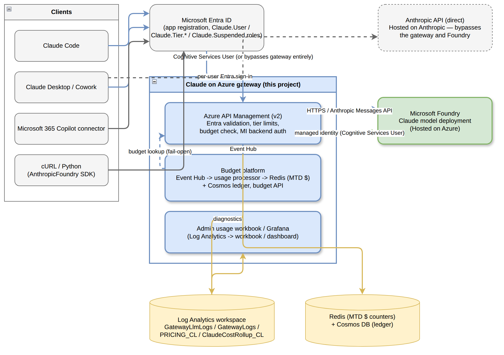
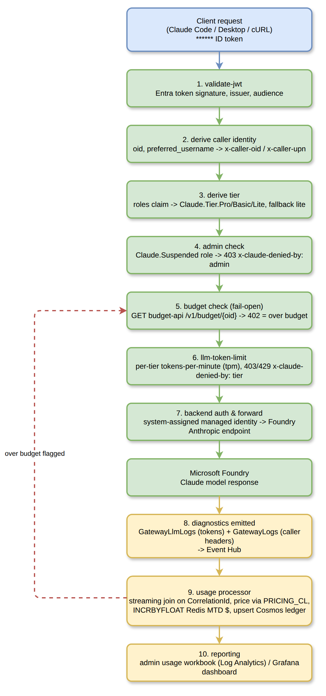
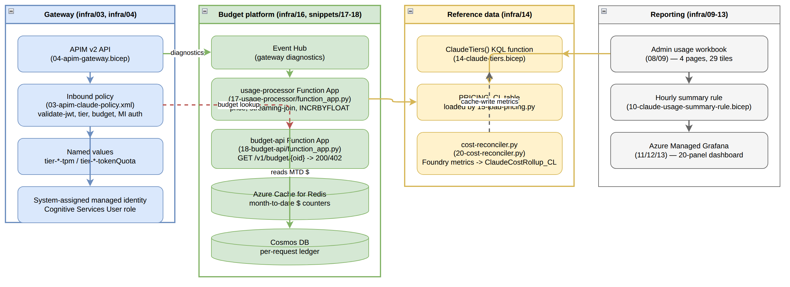

## 1. Executive Summary

Claude on Azure is a working guide and reference implementation for running Anthropic's
Claude models inside the Microsoft ecosystem. It documents and deploys an Entra
ID-authenticated Azure API Management (APIM) gateway that fronts a Claude deployment on
Microsoft Foundry, a per-developer dollar-budget enforcement platform (Event Hub, Redis,
Cosmos DB, two Azure Function Apps), and an admin usage/cost reporting stack (Azure Monitor
workbook and an optional Grafana dashboard). The project is delivered as a Jekyll
documentation site (`index.md`) plus deployable Bicep templates (`infra/`) and the
Python/shell code that runs against the deployed platform (`snippets/`). It targets platform
engineers rolling out Claude Code, Claude Desktop/Cowork, and the Microsoft 365 connector to
large developer populations under centralized identity, quota, and cost controls.

## 2. Architecture Overview



At the system boundary, four kinds of clients call into the platform: **Claude Code**,
**Claude Desktop** (including Cowork), the **Microsoft 365 Copilot connector**, and direct
**cURL/Python** callers using the `AnthropicFoundry` SDK. All of them authenticate against
**Microsoft Entra ID** using an app registration whose app roles (`Claude.User`,
`Claude.Tier.Pro` / `Claude.Tier.Basic` / `Claude.Tier.Lite`, `Claude.Suspended`) drive
authorization and tiering.

The project's own component — the **Claude on Azure gateway** — is the shaded (blue) system
in the diagram. It is not a single service but three cooperating layers, all deployed by the
Bicep templates in `infra/`:

- **Azure API Management (v2 SKU)** validates the Entra token, derives caller identity and
  tier, checks admin-suspension, calls the budget API, enforces per-tier token-per-minute
  limits, and forwards the request to Foundry using its own system-assigned managed identity
  (`Cognitive Services User` role) — the client never holds a Foundry credential directly.
- The **budget platform** (Event Hub, a usage-processor Function App, Redis, and Cosmos DB)
  turns gateway diagnostics into a near-real-time month-to-date dollar figure per developer,
  which the gateway policy reads back on every request.
- The **admin usage workbook and Grafana dashboard** read the same Log Analytics workspace
  the gateway writes diagnostics to, for humans rather than for the request path.

Downstream, **Microsoft Foundry** hosts the actual Claude model deployment ("Hosted on
Azure"). A dashed line to a separate **Anthropic API (direct)** box marks the alternative,
gateway-bypassing path some Claude Desktop configurations can still take — a decision point
the guide calls out explicitly (`index.md`, Part 5, "Two doors marked Anthropic that you
should walk past").

## 3. Processing Pipeline



A single Claude request through the gateway passes through the following stages, all
implemented as one APIM inbound policy (`infra/03-apim-claude-policy.xml`):

1. **`validate-jwt`** — verifies the Entra ID token's signature, issuer, and audience. The
   audience is the *bare application ID* for tokens requesting API version 2, not the
   `api://<guid>` identifier URI — a mismatch here 401s every request with no explanatory
   error.
2. **Derive caller identity** — reads `oid` and `preferred_username` (not `upn`, which does
   not exist on a v2 token) and stamps them as `x-caller-oid` / `x-caller-upn` headers so
   downstream logs are not anonymous.
3. **Derive tier** — reads the `roles` claim; a token carrying both `Claude.User` and a
   `Claude.Tier.*` role selects that tier, and a token with only `Claude.User` falls back to
   `lite`.
4. **Admin check** — `Claude.Suspended` short-circuits the request with `403` and
   `x-claude-denied-by: admin`.
5. **Budget check (fail-open)** — calls the budget API's `GET /v1/budget/{oid}`; a `402`
   response means over budget (`403`, `x-claude-denied-by: budget`), and anything else
   (including no answer) is treated as within budget by design.
6. **`llm-token-limit`** — enforces the tier's tokens-per-minute and token-quota named
   values; a breach returns `429`/`403` with `x-claude-denied-by: tier`.
7. **Backend auth & forward** — the gateway's own managed identity authenticates to Foundry;
   the request is forwarded to `https://<foundry-account>.services.ai.azure.com/anthropic`.
8. **Diagnostics emitted** — Foundry's response produces two separate diagnostic records
   (`GatewayLlmLogs` with token counts, `GatewayLogs` with the caller headers), correlated
   only by `CorrelationId`, delivered to an Event Hub.
9. **Usage processor** (`snippets/17-usage-processor/function_app.py`) performs a streaming
   join of the two record halves through Redis, prices the request from `PRICING_CL`,
   `INCRBYFLOAT`s the developer's month-to-date dollar counter in Redis, and upserts a
   ledger row in Cosmos DB. If the counter now exceeds the tier's `costQuota`, the developer
   is flagged over budget — which step 5 will read back on their *next* request.
10. **Reporting** — the admin usage workbook and Grafana dashboard read the Log Analytics
    workspace independently of the request path, for humans rather than enforcement.

The dashed feedback edge in the diagram (processor → budget check) is the platform's core
enforcement loop: a request is never blocked mid-flight by its own cost, only by the
*previous* request's accumulated spend.

## 4. Core Components



| Group | File(s) | Responsibility |
|---|---|---|
| Gateway | `infra/03-apim-claude-policy.xml`, `infra/04-apim-gateway.bicep` | Entra validation, tier derivation, admin/budget checks, per-tier rate limiting, managed-identity backend auth, diagnostics |
| Budget platform | `infra/16-budget-platform.bicep`, `snippets/17-usage-processor/function_app.py`, `snippets/18-budget-api/function_app.py` | Turns diagnostic events into a per-developer month-to-date dollar figure; exposes a single boolean the gateway policy consumes |
| Reference data | `infra/14-claude-tiers.bicep`, `snippets/15-load-pricing.py`, `snippets/20-cost-reconciler.py` | Single source of truth for tier limits (`ClaudeTiers()` KQL function) and model prices (`PRICING_CL`); reconciles cache-write metrics Azure Monitor exposes nowhere else |
| Reporting | `infra/08/09-claude-usage-workbook.json`/`.bicep`, `infra/10-claude-usage-summary-rule.bicep`, `infra/11`–`13-*grafana*` | Admin-facing dashboards over the same Log Analytics data, independent of the request path |

### Interfaces and contracts

- **`tiersConfig`** is declared identically in three templates — `04-apim-gateway.bicep`,
  `14-claude-tiers.bicep`, and `16-budget-platform.bicep` — each entry carrying `name`,
  `tpm` (tokens per minute, enforced by APIM), `tokenQuota` (enforced by APIM), and
  `costQuota` (a dollar figure enforced only by the usage processor, not by APIM). A
  mismatch across the three is silent: the policy and the processor would throttle against
  different numbers.
- **Budget API contract** (`snippets/18-budget-api/function_app.py`): `GET
  /v1/budget/{oid}` returns `200` (within budget) or `402` (over budget) with no response
  body — the policy reads only the status code, by design, so a garbled response cannot be
  misread as "over budget."
- **`ClaudeTiers()`** (a saved KQL function deployed by `14-claude-tiers.bicep`) is the one
  place the workbook, the Grafana dashboard, and the summary rule read tier limits from,
  rather than each carrying its own copy.

## 5. API Contracts / Message Schemas

| Header / Field | Set by | Meaning |
|---|---|---|
| `x-caller-oid` | gateway policy, step 2 | Entra object ID of the calling developer |
| `x-caller-upn` | gateway policy, step 2 | `preferred_username` from the token |
| `x-caller-tier` | gateway policy, step 3 | Resolved tier: `pro` / `basic` / `lite` |
| `x-claude-denied-by` | gateway policy, steps 4–6 | `admin`, `budget`, or absent (rate/quota denial via `llm-token-limit`) |
| `x-tokens-remaining` | `llm-token-limit` policy | Remaining tokens in the current tier bucket |

| Ledger field (Cosmos, per request) | Source |
|---|---|
| `CorrelationId` (document id, upsert key) | Shared by `GatewayLlmLogs` and `GatewayLogs` |
| tier, model, token counts, priced cost | Usage processor, joined from both log halves and `PRICING_CL` |
| cache-write token counts | Explicitly marked **unknown**, never zero — see §8 |

## 6. Infrastructure & Deployment

Everything under `infra/` is deployed with `az deployment group create` from the repository
root. The gateway and the budget platform reference each other, so `04-apim-gateway.bicep`
is deployed **twice** — once with the budget API pointed at an unreachable placeholder (so
the fail-open budget check passes every request while the platform doesn't exist yet), and
again after the budget platform's outputs are available.

| Order | Template | Deploys |
|---|---|---|
| 1 | `infra/04-apim-gateway.bicep` | APIM v2 + system identity + Anthropic API + tier named values + role assignment |
| 2 | `infra/14-claude-tiers.bicep` + `snippets/15-load-pricing.py` | `ClaudeTiers()` function, `PRICING_CL` table |
| 3 | `infra/16-budget-platform.bicep` + `snippets/17-usage-processor/`, `snippets/18-budget-api/` | Event Hub, Redis, Cosmos, both Function Apps |
| 4 | `infra/04-apim-gateway.bicep` (again) | Re-deployed with the budget platform's real outputs |
| 5 (optional) | `infra/09-workbook.bicep`, `infra/10-claude-usage-summary-rule.bicep` | Admin usage workbook, hourly rollup |
| 6 (optional, billable) | `infra/11-grafana.bicep`, `infra/13-import-grafana-dashboard.sh` | Azure Managed Grafana + 20-panel dashboard |
| 7 (optional) | `infra/21-reconciler-metrics-rbac.bicep` (module) | Monitoring Reader for `snippets/20-cost-reconciler.py` |

Prerequisites: a Foundry resource with a Claude deployment, a Log Analytics workspace, an
Entra app registration with a `Claude.User` app role, the correct `aud` value (decode a real
token — do not guess), and an APIM **v2** SKU (`BasicV2`/`StandardV2`/`PremiumV2`); the
`llm-*` policies do not work on v1 SKUs and `az apim create --sku-name` cannot create v2 at
all, which is why this is Bicep rather than CLI.

Deployment status (see `infra/README.md` for the authoritative, per-template record):
`16-budget-platform.bicep` and `14-claude-tiers.bicep` are deployed and verified end to end
(2026-09-04); `09-workbook.bicep` is deployed and verified (2026-09-02, 22/22 queries against
real data); `04-apim-gateway.bicep`'s policy is verified but its own resource composition has
never been deployed from scratch; `10`, `11`, `11a`, `21` compile but are not deployed from
scratch.

Building without deploying: `for f in infra/*.bicep; do az bicep build --file "$f" --stdout > /dev/null; done` — expect one suppressed `BCP037` in `04-apim-gateway.bicep`.

## 7. Extension Patterns

**Add a new developer tier.** Add an entry to the `tiersConfig` array in *all three*
templates (`infra/04-apim-gateway.bicep`, `infra/14-claude-tiers.bicep`,
`infra/16-budget-platform.bicep`) with matching `name`, `tpm`, `tokenQuota`, and `costQuota`.
`TIERED-QUOTAS.md` explains sizing `tokenQuota` as `costQuota` divided by the cheapest
model's rate, so the token quota does not bind before the dollar cap.

**Update model prices.** Edit the `PRICES` table in `snippets/15-load-pricing.py` and re-run
it against your DCR ingestion endpoint. Prices are stored per 1,000 tokens in `PRICING_CL`;
every consumer (workbook, Grafana, processor) divides by 1,000, so a per-1M-token price
pasted in directly will silently overcharge or undercharge by 1,000x.

**Add a new reporting tile.** Extend `infra/08-claude-usage-workbook.json` (embedded by
`infra/09-workbook.bicep`) or `infra/12-claude-usage-grafana-dashboard.json`, and query
`ClaudeTiers()` and `PRICING_CL` rather than hardcoding tier or price values in the query.

**Close the cache-write cost gap.** `CACHE-TOKEN-ANALYSIS.md` documents that cache writes
(1.25x input for 5-minute TTL, 2x for 1-hour TTL) are unreported by any APIM diagnostic
surface and were 62% of measured Opus 5 spend; `snippets/20-cost-reconciler.py` reads them
from Foundry's own Azure Monitor metrics (`cacheReadInputTokens`, `ephemeral5mInputTokens`,
`ephemeral1hInputTokens`) instead, and needs `infra/21-reconciler-metrics-rbac.bicep`
(Monitoring Reader on the Foundry account) to run.

## 8. Rules & Anti-Patterns

- **Do** decode a real token before setting `gatewayAudience` — for an app with
  `requestedAccessTokenVersion: 2` the `aud` claim is the bare application ID, never
  `api://<guid>`, and every request 401s silently if this is wrong.
- **Do** keep `tiersConfig` identical across all three templates that declare it; a mismatch
  throttles on one set of numbers while the processor budgets against another, with no error
  anywhere.
- **Do** treat the budget check as fail-open by design — an unreachable budget API must not
  stop 100,000 developers from working; the per-tier token quota is the synchronous backstop.
- **Don't** assume the workbook or Grafana numbers are complete dollar ceilings. Cache reads
  are metered; cache **writes** are not, and the measured sample captured only about 38% of
  actual cost in the processor.
- **Don't** gate authorization on the `groups` claim — it is capped at 200 object IDs and
  Entra omits it above that threshold, which is why tier and suspension are app roles.
- **Don't** apply the 5-minute cache-write rate to 1-hour writes when reconciling cost; that
  specific substitution caused a measured $3.28 shortfall in the seven-day sample
  (`tests/test_cache_accounting.py`).
- **Don't** try to update `10-claude-usage-summary-rule.bicep`'s destination table retention
  with `az monitor log-analytics workspace table update` — it sends the whole schema and
  fails the summary rule's own validation; use `az rest --method patch`.

## 9. Dependencies

| Category | Technology / Package | Where used |
|---|---|---|
| Documentation site | Jekyll (`minima` theme), kramdown/GFM | `_config.yml`, `index.md` |
| Infra-as-code | Bicep (Azure CLI `az bicep`) | `infra/*.bicep` |
| API gateway | Azure API Management v2 (`llm-*` policies) | `infra/04-apim-gateway.bicep`, `infra/03-apim-claude-policy.xml` |
| Compute | Azure Functions (Python, Linux plan) | `snippets/17-usage-processor/`, `snippets/18-budget-api/` |
| Data stores | Azure Cache for Redis, Azure Cosmos DB, Log Analytics workspace | `infra/16-budget-platform.bicep` |
| Reporting | Azure Monitor Workbooks, Azure Managed Grafana | `infra/08/09`, `infra/11`–`13` |
| Python libraries | `azure-functions`, `azure-cosmos`, `azure-identity`, `redis`, `azure-monitor-ingestion`, `requests` | `snippets/17-usage-processor/requirements.txt`, `snippets/18-budget-api/requirements.txt` |
| Testing | `unittest` (standard library) | `tests/test_cache_accounting.py` |
| Site build | `bundle` / Gemfile (Ruby, Jekyll) | `Gemfile` |

## 10. Code Structure

```
index.md                    the guide (1,068 lines) — Parts 1-7 plus governance/decision tables
README.md                    repo overview, deploy pointer, licensing
TIERED-QUOTAS.md             design doc: three tiers, per-developer $ budgets at ~100K developers
CACHE-TOKEN-ANALYSIS.md      measured cache-accounting gaps and remediation review
AIGATEWAY-ISSUE-DRAFT.md     draft issue text
images/                      guide screenshots + architecture.drawio, tiered-quotas-architecture.drawio

infra/                       deployable Bicep + the APIM policy XML + workbook/dashboard JSON
  03-apim-claude-policy.xml          inbound policy: auth, tier, budget, MI backend auth
  04-apim-gateway.bicep               APIM v2 + identity + API + named values + role assignment
  08-claude-usage-workbook.json       admin workbook definition (embedded by 09)
  09-workbook.bicep                   deploys the workbook
  10-claude-usage-summary-rule.bicep  hourly rollup past 30-day raw retention
  11-grafana.bicep / 11a-*rbac.bicep  Azure Managed Grafana + cross-RG RBAC
  12-claude-usage-grafana-dashboard.json  20-panel dashboard definition
  13-import-grafana-dashboard.sh      imports the dashboard (no ARM path for AMG dashboards)
  14-claude-tiers.bicep               ClaudeTiers() KQL function + PRICING_CL + DCR
  16-budget-platform.bicep            Event Hub, Redis, Cosmos, two Function Apps
  21-reconciler-metrics-rbac.bicep    Monitoring Reader module for the cost reconciler
  README.md                           prerequisites, deploy order, per-template verification status

snippets/                    code that runs against the deployed platform
  01-curl-entra.sh, 02-python-entra.py    keyless Entra auth examples (cURL, AnthropicFoundry SDK)
  05-gateway-smoke-test.sh                positive/negative/streaming gateway smoke tests
  06-claude-code-managed-settings.json    admin-pushed Claude Code settings
  07-claude-gateway-token.sh              apiKeyHelper minting a per-user Entra token
  15-load-pricing.py                      maintained Claude prices -> PRICING_CL (+ Redis)
  17-usage-processor/function_app.py      Event Hub trigger: price, count, flag over-budget
  18-budget-api/function_app.py           the boolean the gateway policy asks
  19-tier-smoke-test.sh                   per-tier limits, rejection reasons, fail-open
  20-cost-reconciler.py                   Foundry cache-write metrics -> ClaudeCostRollup_CL

tests/
  test_cache_accounting.py     regression tests for pricing and processor arithmetic

docs/                         generated documentation (this file, diagrams, Word export)
```
