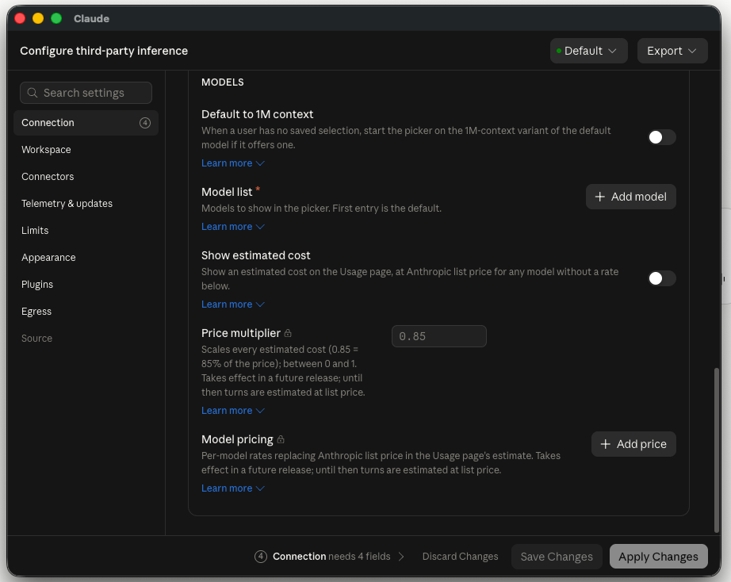
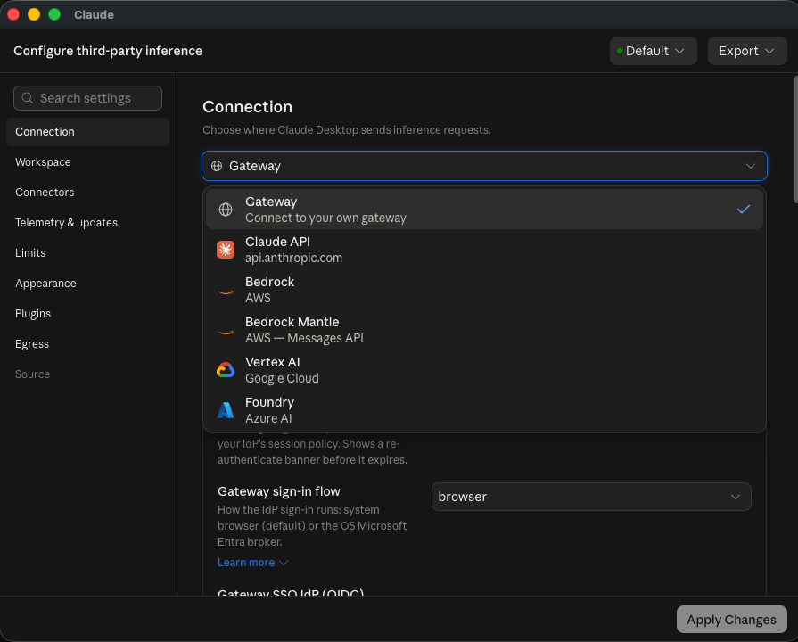
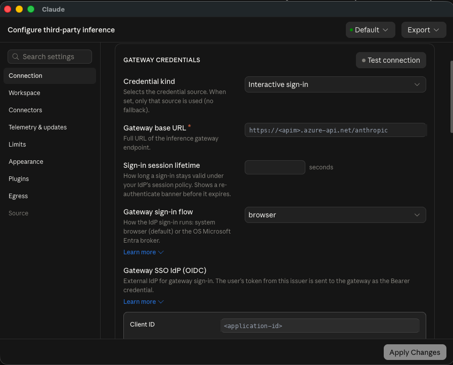
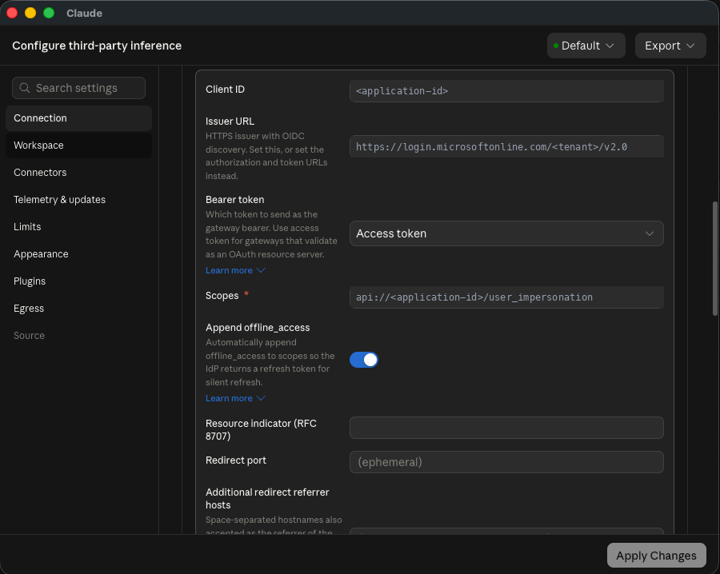
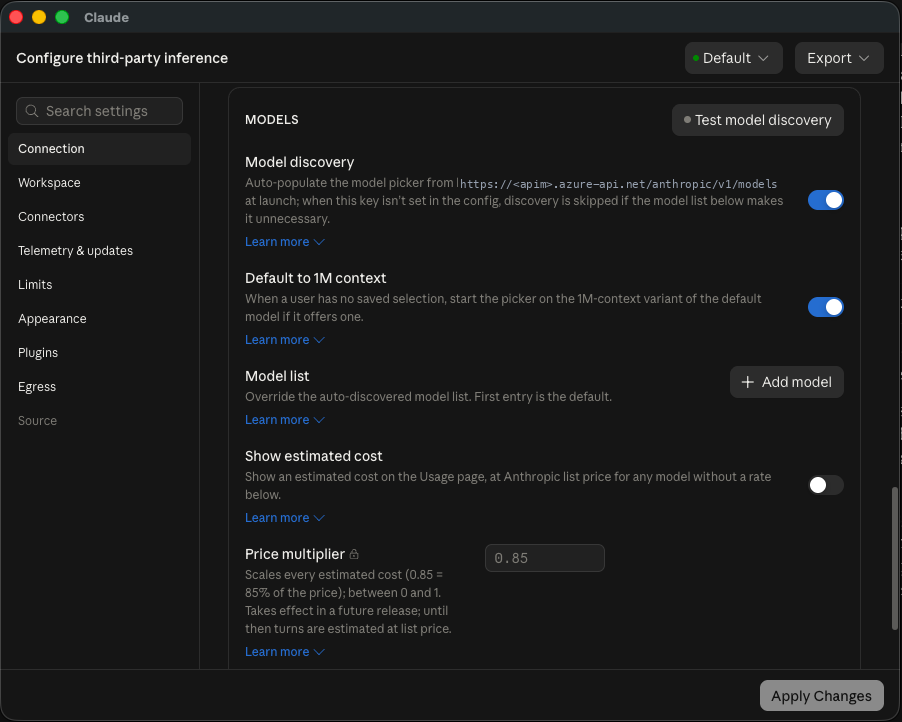

*A working guide to Claude in Microsoft Foundry, Claude Code, Claude Desktop, API Management as a gateway, per-developer usage reporting, and the Microsoft 365 connector — including how to run Cowork on your own Azure endpoint.*

I spend most of my week in front of Indian enterprises — banks, NBFCs, fintechs — who want frontier AI without handing a new vendor their data, their procurement cycle, and their compliance posture. For the last year the answer to "can we use Claude?" was awkward. It meant a separate contract, a separate invoice, and a separate conversation with the security team.

That changed. [Claude went generally available in Microsoft Foundry on 29 June 2026](https://azure.microsoft.com/en-us/blog/claude-in-microsoft-foundry-is-now-generally-available/). Claude now runs under your Azure subscription: Entra ID for auth, Azure RBAC for access, Azure Monitor for telemetry, and one line on your existing Azure invoice.

This is the guide I wish I'd had. The API, CLI, and gateway work below was run against a live Foundry resource and a live API Management instance; the Claude Desktop walkthroughs follow Microsoft's and Anthropic's deployment docs, with screenshots of the actual configuration dialogs.

---

## First, get the mental model right

The single most common confusion I see: people assume "Anthropic on Azure" is one thing. It's one **model plane** and three **clients** that can point at it.

| Surface | What it is | Where inference runs |
|---|---|---|
| **Foundry deployment** | The model plane | Your Foundry resource |
| **Claude Code** (CLI) | Terminal coding agent | Your Foundry resource |
| **Claude Desktop** in 3P mode | Desktop app hosting **Cowork and Claude Code** | Your Foundry resource |
| **Cowork on claude.com** | Standard subscription product | Anthropic |

The key point: **Cowork is not locked to Anthropic's infrastructure.** Claude Desktop has a third-party inference mode that routes every model call to your own Foundry resource — billed to your Azure account, with conversations stored locally on the device. That's the deployment enterprises actually want, and it's the least-known part of this whole story.

What you're choosing between is *how your users reach Claude*: terminal, desktop app, or your own code. The governance boundary is the same for all three — and Part 5 puts a single gateway in front of all three, which is what turns a pilot into a rollout.

One thing that table deliberately leaves out: the **Microsoft 365 connector**, which is about what Claude can *read* in your tenant rather than where it runs. Different boundary, different admin. Part 7.

---

## Part 1 — The model plane

Twelve Claude models are in the Foundry catalog today. Opus 5 and Sonnet 5 are GA; Mythos 5 and Fable 5 are in preview. Note the context window: **1000k**.


Deployment is the standard Foundry flow — **Discover → Models**, pick a Claude model, **Deploy**, then **Custom settings**. On your first Claude deployment you'll accept Azure Marketplace terms once.

Here's my resource with four Claude deployments alongside the OpenAI ones. They coexist in a single Foundry resource behind a single endpoint, which is the whole point.


### If the right-hand pane says "API Key authentication is disabled"

That's the state my resource is in, and it's the one you'll hit in most regulated tenants — the resource has `disableLocalAuth: true`, so there is no key to copy and nothing to paste into a key field. Asking Azure for one just fails:

```
$ az cognitiveservices account keys list -n <resource> -g <rg>
ERROR: (BadRequest) Failed to list key. disableLocalAuth is set to be true
```

You are not blocked. You have everything you need: the **endpoint** and your own Entra identity.

**Grab two values from that same pane.** The **Project endpoint** gives you your resource name — the `contoso-foundry` in `https://contoso-foundry.services.ai.azure.com/...`. The **deployment name** is in the grid on the left (`claude-opus-5`). That's the whole configuration.

**Make sure you have a role that permits inference** on the resource — **Cognitive Services User** or **Azure AI User**. Without it you'll get `403` no matter how valid your token is.

**Then authenticate as yourself.** The Anthropic path lives at `/anthropic` on that host, and it takes an Entra bearer token:

```bash
az login
TOK=$(az account get-access-token --resource https://ai.azure.com --query accessToken -o tsv)

curl https://<resource>.services.ai.azure.com/anthropic/v1/messages \
  -H "Authorization: Bearer $TOK" \
  -H "content-type: application/json" \
  -H "anthropic-version: 2023-06-01" \
  -d '{"model":"claude-opus-5","max_tokens":64,
       "messages":[{"role":"user","content":"ping"}]}'
```

If that returns a message, you're done — every other surface in this post is the same two values wired up differently:

| Surface | What you set |
|---|---|
| SDK | `AnthropicFoundry(resource=..., azure_ad_token_provider=...)` |
| Claude Code | `CLAUDE_CODE_USE_FOUNDRY=1` + `ANTHROPIC_FOUNDRY_RESOURCE=<resource>` |
| Claude Desktop | Credential kind → **Interactive sign-in** (the static-key option is unusable here) |

A warning on that endpoint: **neither value the tooling hands you is the Anthropic endpoint.** The portal pane shows a *Project* endpoint ending in `/api/projects/<name>`, and `az cognitiveservices account show` reports the host as `<resource>.cognitiveservices.azure.com`. The Anthropic path is neither:

```
portal pane   https://<resource>.services.ai.azure.com/api/projects/<name>
az CLI        https://<resource>.cognitiveservices.azure.com/
what you want https://<resource>.services.ai.azure.com/anthropic/v1/messages
```

Take the **resource name** from either and build the URL yourself. Don't paste.

Full detail on both auth methods is in Part 2.

### The decision that actually matters: where inference runs

Buried in **Model version settings** is the most consequential choice in this entire setup, and the portal presents it as though it were a version number.


Open the dropdown and the real meaning appears:


- **Version 1 → Hosted on Anthropic infrastructure**
- **Version 2 → Hosted on Azure**

That's not a version bump. That's a data-residency and architecture decision wearing a version number as a disguise.

With **Hosted on Azure**, inference runs on Azure infrastructure. Prompts and completions stay within Azure; only usage metadata and safety-flagged content leave. For a regulated Indian financial institution, this is usually the deciding factor.

**A practical warning:** the Azure Resource Manager API does *not* expose the hosting option. Querying the deployment returns `"publisher": null` and a bare version string. The portal is the only reliable place to read it. If you're building deployment automation, the version number is your only handle — document it.

### What works on an Azure-hosted deployment, and what doesn't

Tested against a Hosted-on-Azure `claude-opus-5` deployment:

**Works:**
- Structured outputs via `output_config.format`
- Server-side `web_search` — returns real results
- Files API
- Streaming (SSE), prompt caching, extended thinking, the 1M context window

**Doesn't work:**
- `code_execution` — returns `400`, *"not supported in your workspace"*
- Message Batches API — returns `404 api_not_supported` (this one is absent from Foundry entirely, on either hosting option)
- Admin API, Compliance API, Models API, Managed Agents

Plan around `code_execution` and Batches. Everything else you'd reach for in a production RAG or agent workload is available.

One parameter change to watch on Opus 5: `thinking: {"type": "enabled", "budget_tokens": N}` is rejected. The current shape is `thinking: {"type": "adaptive"}` paired with `output_config: {"effort": "high"}`. This isn't Foundry-specific — it's a model-generation change — but it will break code you port over.

One useful detail: `usage.inference_geo` came back `"global"` on the Azure-hosted deployment and `"not_available"` on the Anthropic-hosted one — handy for asserting placement from inside your own telemetry.

---

## Part 2 — Calling it

The endpoint follows a fixed shape:

```
https://{resource}.services.ai.azure.com/anthropic/v1/messages
```

Two auth methods: API keys, or Entra ID. **Use Entra ID.**

Even where keys are available, keyless is the posture to aim for: nothing to rotate, nothing to leak, nothing sitting in a `.env` someone commits at 11pm. Access is Azure RBAC — `Azure AI User` or `Cognitive Services User` — and it's revoked the moment someone leaves the directory.

Here's a real call:

```bash
TOK=$(az account get-access-token --resource https://ai.azure.com --query accessToken -o tsv)

curl https://{resource}.services.ai.azure.com/anthropic/v1/messages \
  -H "content-type: application/json" \
  -H "Authorization: Bearer $TOK" \
  -H "anthropic-version: 2023-06-01" \
  -d '{
    "model": "claude-opus-5",
    "max_tokens": 100,
    "messages": [{"role": "user", "content": "Reply with exactly: Claude on Foundry is live."}]
  }'
```

```json
{"model":"claude-opus-5","type":"message","role":"assistant",
 "content":[{"type":"text","text":"Claude on Foundry is live."}],
 "stop_reason":"end_turn",
 "usage":{"input_tokens":25,"output_tokens":13,"inference_geo":"global"}}
```

In Python, use the Foundry client class rather than the base one:

```python
from anthropic import AnthropicFoundry
from azure.identity import DefaultAzureCredential, get_bearer_token_provider

token_provider = get_bearer_token_provider(
    DefaultAzureCredential(), "https://ai.azure.com/.default"
)

client = AnthropicFoundry(
    azure_ad_token_provider=token_provider,
    resource="your-resource-name",
)

message = client.messages.create(
    model="claude-opus-5",       # deployment name, NOT model ID
    max_tokens=1024,
    messages=[{"role": "user", "content": "What is the capital of France?"}],
)
print(message.content)
```

**The `model` parameter takes your deployment name, not the model ID.** They match by default, which hides the distinction until someone names a deployment `claude-prod` and everything breaks.

### A trap the portal will walk you into

The Foundry portal generates a Python sample for your deployment, and it passes `base_url=`:

```python
client = AnthropicFoundry(
    azure_ad_token_provider=token_provider,
    base_url="https://{resource}.services.ai.azure.com/anthropic",   # portal's version
)
```

Copy that into an environment where you've *also* configured Claude Code — which requires `ANTHROPIC_FOUNDRY_RESOURCE` — and it dies:

```
ValueError: base_url and resource are mutually exclusive
```

The SDK reads `ANTHROPIC_FOUNDRY_RESOURCE` and `ANTHROPIC_FOUNDRY_BASE_URL` from the environment automatically, so your explicit `base_url` collides with the env-supplied resource. Pass exactly one. I use `resource=` and let the SDK build the URL.

Two more traps:

**`output_format` is deprecated.** Use `output_config.format`. My first structured-output call failed on both deployments with a deprecation error I initially misread as a hosting restriction. If you're copying from a blog post written before mid-2026, this will bite you.

**Foundry SDK support is partial.** C#, Java, PHP, Python, and TypeScript have native Foundry clients. Go and Ruby don't — you can point the standard SDK at the base URL, but pass credentials explicitly or you risk leaking a Claude API key to your Azure endpoint.

The portal's **Details** tab generates working sample code for your specific deployment, defaulted to Entra auth. Use it as your starting point.


---

## Part 3 — Claude Code on Foundry

This is the part that surprises people. Claude Code — the terminal agent — points at your Foundry deployment with environment variables. No wizard, no separate subscription. Your developers' agentic coding runs on the same governed endpoint, billed to the same Azure invoice.

```bash
export CLAUDE_CODE_USE_FOUNDRY=1
export ANTHROPIC_FOUNDRY_RESOURCE=<your-resource-name>

# Pin every alias to a deployment that actually exists
export ANTHROPIC_DEFAULT_OPUS_MODEL='claude-opus-5'
export ANTHROPIC_DEFAULT_SONNET_MODEL='claude-sonnet-5'
export ANTHROPIC_DEFAULT_HAIKU_MODEL='claude-haiku-4-5'
```

With no API key set anywhere, auth falls through to the Azure default credential chain — the same `az login` session you already have:

```
$ claude -p "Reply with exactly: Claude Code is running on Microsoft Foundry."
Claude Code is running on Microsoft Foundry.
```

Auth precedence, highest first: `ANTHROPIC_FOUNDRY_AUTH_TOKEN` → `ANTHROPIC_FOUNDRY_API_KEY` → default credential chain. Inside a session, `/status` shows `Microsoft Foundry` and your resource name. (Note `/logout` is unavailable on Foundry — identity is Azure's job now.)

### Pin your models. Seriously.

This is the failure that will generate your first support ticket. Unset the pins and use the bare alias:

```
$ claude -p "say hi" --model opus
The model claude-opus-4-6 is not available on your foundry deployment.
Try --model to switch to claude-opus-4-5, or ask your admin to enable this model.
```

The `opus` alias resolves to Claude Code's built-in Foundry default — Opus 4.6 — which isn't deployed here. Foundry performs no startup model check, so this surfaces at the *first prompt*, not at launch.

Claude Code handles it gracefully with a clear message. But multiply it across fifty developers on rollout day and it's a bad morning. **Pin the aliases, and choose a specific model version on the Azure deployment rather than auto-update-to-latest** — otherwise a silent version bump can move your deployment out from under your pins.

Prompt caching is on automatically. `ENABLE_PROMPT_CACHING_1H=1` extends the TTL from 5 minutes to 1 hour, billed at a higher write rate — usually worth it for large shared codebases.

---

## Part 4 — Claude Desktop on Foundry (and this is where Cowork lives)

[Claude Cowork](https://claude.com/product/cowork) is Anthropic's agent for knowledge work: describe an outcome, grant access to files and connectors, and it executes multi-step tasks — drafting documents, organising files, synthesising research — showing its work as it goes.

Here's the part most people miss. **Claude Desktop is the host application for both Cowork and Claude Code**, and it has a third-party inference mode that points the whole thing at your Foundry resource. Microsoft's documentation puts it plainly: *"all Claude model requests route through your own Foundry resource. Billing stays on your Azure account, conversations remain on user devices."*

No Anthropic seat licensing. No conversation data leaving the device. Token consumption on your Azure bill. For a bank that wants its analysts using an agentic assistant without a new vendor relationship, this is the answer.

### Turn on Developer Mode

Third-party inference is behind a developer flag. In Claude Desktop: **Help → Troubleshooting → Enable Developer Mode**, then **Developer → Configure Third-Party Inference…**


### Pick a credential kind

Set the inference provider to **Foundry**. The next choice — **Credential kind** — decides how much work the rest of this is. Note the dialog's warning: when credential kind is set, *only* that source is used, with no fallback.

**Static API key** is the short path. Two fields: your Foundry resource name, and the API key — **the same key you'd use for any other call to that resource**. Nothing new to create, no Entra app registration, no tenant or client ID. Those fields don't even render in this mode; the footer just says *Connection needs 2 fields*.


That's a shared secret sitting in a managed profile on every device, so it's a pilot configuration, not a rollout one. But if you're demoing this to a customer on Thursday, it's ten minutes of work.

One thing to check first: if your Foundry resource has `disableLocalAuth: true` — as mine does — there is no key to paste, and this path is closed to you entirely. Go straight to interactive sign-in.

**Interactive sign-in** gives you per-user Entra identity, and it's what a real deployment uses. Both **Entra ID tenant ID and client ID are mandatory** — they carry the red asterisk, and the dialog won't let you apply without them.


Those two GUIDs come from an Entra app registration you have to create first. That's the next section.

### Register an Entra ID app (interactive sign-in only)

Skip this entirely if you're using a static API key.

In the [Entra admin center](https://entra.microsoft.com) → **Identity → Applications → App registrations → New registration**. Then:

**API permissions** — add a permission, find **Azure Cognitive Services**, choose **Delegated**, and add **`user_impersonation`**. The app requests it as the scope `https://cognitiveservices.azure.com/.default`. Click **Grant admin consent** — without it, sign-in fails with `AADSTS65001`.

**Authentication** — depends on the sign-in flow you want:

| Flow | Registration requirement |
|---|---|
| `device-code` (default) | Enable **Allow public client flows** |
| `browser` | Add redirect URI `http://127.0.0.1/callback` under **Mobile and desktop applications** |
| `broker` | Allow public client flows + the platform broker redirect URI |

Two traps here, both of which produce error codes you'll otherwise spend an afternoon on:

- The browser flow needs the **literal `127.0.0.1`, not `localhost`**. Entra matches scheme, host, and path exactly — it only ignores the port. Wrong value gives you `AADSTS50011`.
- Register that URI under **Mobile and desktop applications**, *not* **Web**. Under Web, the browser shows a success page and the app still fails, with `AADSTS7000218` buried in the logs.

Finally, grant your users a role on the Foundry resource that permits inference — **Cognitive Services User** is the obvious one. Record the **Directory (tenant) ID** and **Application (client) ID** and paste them into the dialog.

### Sign-in flow, models, and cost controls

Scroll down for the remaining settings.

**Which flow?** Device code is the default and needs no redirect URI, but Conditional Access policies that block device-code auth will kill it. The browser flow sidesteps that entirely and is my default recommendation. The broker flow is the only one that satisfies Conditional Access policies requiring a compliant or managed device — if your customer has device-compliance CA rules, broker is not optional.

**Model list** — add one entry per Foundry **deployment name**. The first entry is the default. Same rule as everywhere else in this post: deployment name, not model ID.



The same pane carries the cost controls, which matter if you're doing showback to business units. **Show estimated cost** puts a per-session estimate on the Usage page. **Price multiplier** scales that estimate — `0.85` means 85% of list — and **Model pricing** replaces Anthropic list price with your own per-model rates.

Read the fine print on both: they **take effect in a future release**. Until then the app estimates at list price no matter what you configure here, so don't build a chargeback report on those numbers yet.

Then **Apply locally**. Claude Desktop relaunches in 3P mode, and the sign-in screen offers **Start in Cowork on 3P**.

### Roll it out

Once one machine is validated, click **Export** in the same window to produce a `.mobileconfig` (macOS) or `.reg` (Windows) for Intune, Jamf, or Group Policy. Check the **Egress** section for the hostnames to allowlist — sign-in reaches `login.microsoftonline.com` in addition to your Foundry endpoint.

Devices that receive the managed configuration enter 3P mode automatically at first launch. The underlying keys are `inferenceProvider`, `inferenceFoundryResource`, `inferenceFoundryTenantId`, `inferenceFoundryClientId`, `inferenceFoundryAuthFlow`, and `inferenceModels`, so you can also deliver them straight from MDM without the UI.

You can also export full session telemetry — prompts, token counts, estimated cost, tool results, per-user attribution — to your own OpenTelemetry collector.

### One caveat worth stating

Microsoft's documentation is candid about the current state: Anthropic has noted that data-residency and "no conversation data sent to Anthropic" guarantees *equivalent to those already in place for Vertex AI and Amazon Bedrock* are **coming** for Microsoft Foundry. Inference goes to your endpoint and conversations stay on the device today, but if your customer's approval hinges on a contractual guarantee rather than an architectural one, check the current status before you commit to it in a design review.

Also check the subscription type early. Claude models in Foundry require a paid subscription with an active pay-as-you-go billing method. **Free trial, student, credit-only sponsored subscriptions, CSP subscriptions, and Enterprise accounts in South Korea are not supported** — a detail that has derailed more than one proof of concept on day one.

---

## Part 5 — Claude behind your own gateway

Everything so far has each client talking straight to the Foundry endpoint, holding the end user's own Entra credential. That's the right way to prove the thing works. It is not how you hand it to four hundred people.

Here's the question I get, almost verbatim, in every second meeting:

**"Our admin team wants to configure this once, centrally. Business users should open Claude Desktop and have it work. Developers should open Claude Code and have it work. Neither group should be touching endpoints, resource names, or keys."**

That's a gateway. On Azure, that's API Management.

And the piece most people don't know: **Claude Desktop has a first-class Gateway connection type**, sitting in the same dropdown as Foundry, Bedrock, and Vertex. Anthropic's own docs name Azure API Management as a supported gateway. This isn't a workaround — it's a shipped product feature with per-user sign-in built in.



**What the gateway actually buys you.** One place to decide who may call Claude. One place to cap what they spend. One place to attribute cost to a human rather than a shared secret. And one URL that survives you adding a second Foundry resource, moving a region, or splitting Opus and Haiku across deployments — none of which your users have to hear about.

The request path is short. The user's Entra token reaches APIM. APIM validates the JWT, checks an app role, and then **replaces** that token with one minted from its own managed identity before calling Foundry.

That replacement is the part to get right. The user's token must never reach Foundry — the audience is wrong, and forwarding it leaks a user credential to a backend that has no business holding one.

```
client sends    Authorization: Bearer <user's Entra token, aud = your API app>
APIM validates  tenant, audience, and the Claude.User app role
APIM sends      Authorization: Bearer <APIM's own token, aud = ai.azure.com>
Foundry sees    a request from the gateway, on behalf of nobody in particular
```

Both Claude clients speak the native Anthropic Messages API, so the gateway must too. Claude Desktop's Gateway mode specifically requires `POST /v1/messages` in Anthropic shape, with `GET /v1/models` optional for model auto-discovery. That's convenient: one API definition, one policy, both clients.

### Pick a tier before you pick anything else

This decision gates everything and it is easy to get wrong on day one.

APIM's AI gateway policies — `llm-token-limit`, `llm-emit-token-metric`, `llm-semantic-cache-lookup` — understand three request schemas: OpenAI Chat Completions, Google Vertex AI, and **the Anthropic Messages API, currently supported in API Management v2 tiers only**.

"v2 tiers" means exactly **BasicV2**, **StandardV2**, **PremiumV2**. On Developer, Basic, Standard, Premium (classic), or Consumption, the Anthropic schema isn't listed. Consumption is doubly out: it supports neither `llm-token-limit` nor server-sent events, and both Claude clients stream everything.

**And here's the trap that will cost you an afternoon:** `az apim create --sku-name` accepts only `Basic, Consumption, Developer, Isolated, Premium, Standard`. **The v2 SKUs cannot be created from the Azure CLI at all.** Bicep, ARM, or the portal — those are your options. Since v2 is a hard requirement for the Anthropic schema, the CLI path is closed before you start.

While we're here: there is no `az apim api policy` command either. The only policy command in the entire `az apim` tree is `az apim graphql resolver policy`. Policies come from ARM, Bicep, or REST.

### Provision it

`sku.name` is case-sensitive with a capital `V` and no space, and `sku.capacity` is required.

```bicep
resource apim 'Microsoft.ApiManagement/service@2024-05-01' = {
  name: apimName
  location: location
  sku: { name: 'StandardV2', capacity: 1 }
  identity: { type: 'SystemAssigned' }
  properties: {
    publisherEmail: publisherEmail
    publisherName: publisherName
  }
}

resource claudeApi 'Microsoft.ApiManagement/service/apis@2024-05-01' = {
  parent: apim
  name: 'claude-anthropic'
  properties: {
    displayName: 'Claude (Anthropic Messages API)'
    path: 'anthropic'
    protocols: [ 'https' ]
    serviceUrl: 'https://${foundryAccountName}.services.ai.azure.com/anthropic'
    subscriptionRequired: false
  }
}
```

`subscriptionRequired: false` is deliberate. Authentication here is Entra ID. Layering an APIM subscription key on top reintroduces exactly the shared secret this design exists to remove.

Then grant APIM's managed identity the right to run inference:

```bicep
// Cognitive Services User
var cognitiveServicesUser = 'a97b65f3-24c7-4388-baec-2e87135dc908'

resource inferenceRole 'Microsoft.Authorization/roleAssignments@2022-04-01' = {
  scope: foundry
  name: guid(foundry.id, apim.id, cognitiveServicesUser)
  properties: {
    roleDefinitionId: subscriptionResourceId('Microsoft.Authorization/roleDefinitions', cognitiveServicesUser)
    principalId: apim.identity.principalId
    principalType: 'ServicePrincipal'
  }
}
```

**Microsoft's docs contradict each other on this role, so be careful.** The generic APIM AI-authentication guidance tells you to assign **Cognitive Services OpenAI User**. That guidance is written for Azure OpenAI and it is *wrong for the `/anthropic` surface*. Foundry's own keyless-auth documentation is explicit: **Cognitive Services User** is the role that grants inference, and Owner and Contributor do not. `Foundry User` is the Foundry-native equivalent. Role IDs survived the recent role renames, so use GUIDs in IaC and ignore the display names. Assignments take up to five minutes to propagate — if your first call 403s, wait before you start debugging.

One thing not to attempt: **managed-identity credentials on a `backends` resource in Bicep**. The portal offers it; the ARM template schema doesn't expose it, right through `2025-09-01-preview`. Do it in policy instead.

### The policy

Four moves, in order: prove who's calling, capture their identity, swap the credential, then meter.

```xml
<validate-azure-ad-token
    tenant-id="{{entra-tenant-id}}"
    header-name="Authorization"
    failed-validation-httpcode="401"
    output-token-variable-name="jwt">
  <audiences>
    <audience>{{claude-gateway-audience}}</audience>
  </audiences>
  <required-claims>
    <claim name="roles" match="any">
      <value>Claude.User</value>
    </claim>
  </required-claims>
</validate-azure-ad-token>

<set-variable name="callerOid"
              value="@(((Jwt)context.Variables[&quot;jwt&quot;]).Claims.GetValueOrDefault(&quot;oid&quot;, &quot;unknown&quot;))" />

<authentication-managed-identity
    resource="https://ai.azure.com"
    output-token-variable-name="foundry-token"
    ignore-error="false" />
<set-header name="Authorization" exists-action="override">
  <value>@("Bearer " + (string)context.Variables["foundry-token"])</value>
</set-header>

<llm-token-limit
    counter-key="@((string)context.Variables[&quot;callerOid&quot;])"
    tokens-per-minute="20000"
    estimate-prompt-tokens="false"
    tokens-consumed-header-name="x-tokens-consumed" />
```

**Those `&quot;` entities are not me being fussy.** A policy expression sitting in an *attribute* cannot contain a raw double quote — it closes the attribute, and the document stops being well-formed XML. Microsoft's own policy documentation prints samples with raw quotes in exactly these positions, and they will not deploy as written. Expressions in *element* content — the `<value>` blocks — are unaffected, which is why the `set-header` above reads normally. Worth knowing before you spend twenty minutes staring at a validation error that just says the policy is malformed.

**That audience value is not what you'd guess.** If your app registration uses `requestedAccessTokenVersion: 2`, the `aud` claim is the **bare application ID** — not the `api://<guid>` identifier URI. Only v1 tokens carry the URI form. Decode a token and check before you write the policy:

```
aud      11111111-2222-3333-4444-555555555555
ver      2.0
oid      aaaaaaaa-bbbb-cccc-dddd-eeeeeeeeeeee
roles    ['Claude.User']
```

Get this wrong and every request is rejected, with nothing in the error to tell you why. `roles` and `oid` should both be present too — the first is what `required-claims` gates on, the second is your counter key.

One related snag while setting the app up: `az account get-access-token --resource api://<appId>` only works once you've added the Azure CLI's own client ID (`04b07795-8ddb-461a-bbee-02f9e1bf7b46`) to the app's `preAuthorizedApplications`. And the scope has to exist *before* you can pre-authorize it — doing both in one PATCH fails with `Property api.preAuthorizedApplications.delegatedPermissionIds has a Permission Id that cannot be found in the AppPermissions sets`. Two calls, in order.

**Gate on an app role, not a group.** This is the single most common way to build a gateway that works in the pilot and fails in production. Entra caps the `groups` claim at **200 group object IDs**. Past that, it omits `groups` from the token entirely and substitutes `_claim_names` and `_claim_sources` pointing at Microsoft Graph — at which point `required-claims` fails closed, and every legitimate user in a large directory is locked out. App roles have no overage limit. If you must use groups, configure the optional claim as "Groups assigned to the application" to stay under the cap.

**`resource="https://ai.azure.com"` — not `cognitiveservices.azure.com`.** Every APIM sample you'll find uses the latter, because every APIM sample is written for Azure OpenAI. Foundry's `/anthropic` surface wants scope `https://ai.azure.com/.default` — the same resource the cURL in Part 1 uses. No Microsoft document shows this value inside `authentication-managed-identity`; it is nonetheless the correct one. Keep `ignore-error="false"` so a credential failure is loud rather than a silent unauthenticated forward.

**Use `oid`, not email or UPN**, as your counter key and your metric dimension. Email changes. Object IDs don't.

**Two failure modes look identical.** A request with no token and a request bearing a *valid token for the wrong audience* both return the same flat 401 with the same message. Nothing in the response mentions audiences:

| Case | Result |
|---|---|
| Valid token with the `Claude.User` role | `200` |
| No token | `401 Unauthorized. Access token is missing or invalid.` |
| Valid token, wrong audience | `401` — byte-for-byte identical |

The second reads as "the gateway is broken" when it is doing exactly its job. Check the audience first.

Finally, one governance point straight from Microsoft's own documentation, which belongs in your design review rather than your runbook: *"Token forwarding is the customer's responsibility… API Management does not validate which backend the token is sent to."* Anyone holding `Microsoft.ApiManagement/service/apis/policies/write` can mint tokens as the gateway identity and send them wherever they like. The gateway concentrates trust — scope who can edit its policies accordingly.

### Point Claude Code at it

Two files, both pushed by the admin team, and the developer sets nothing.

The first is a credential helper — a script whose only job is to print a fresh token and nothing else:

```bash
#!/usr/bin/env bash
set -euo pipefail
az account get-access-token \
  --resource "api://<application-id-uri>" \
  --query accessToken --only-show-errors -o tsv
```

The contract is strict, and the failure modes are unhelpful if you break it: print **only** the credential to stdout. A banner, a prompt, or a stray CLI upgrade notice and the helper fails. Non-zero exit, timeout, or empty output fails the request after three attempts. Take longer than ten seconds and Claude Code shows a warning banner.

The second is the managed settings file:

```json
{
  "env": {
    "ANTHROPIC_BASE_URL": "https://<apim-name>.azure-api.net/anthropic",
    "CLAUDE_CODE_API_KEY_HELPER_TTL_MS": "2700000",
    "ANTHROPIC_DEFAULT_OPUS_MODEL": "claude-opus-5",
    "ANTHROPIC_DEFAULT_SONNET_MODEL": "claude-sonnet-5",
    "ANTHROPIC_DEFAULT_HAIKU_MODEL": "claude-haiku-4-5"
  },
  "apiKeyHelper": "/usr/local/bin/claude-gateway-token"
}
```

The `env` block is the lever that makes this a zero-touch rollout — it injects those variables into every session without anyone editing a shell profile. Model pins carry over from Part 3 for the same reason they mattered there: Foundry runs no startup model check, so a bad alias surfaces at the first prompt.

The helper's default refresh is **five minutes**; Entra access tokens live about an hour. `2700000` ms — 45 minutes — keeps a margin without shelling out to `az` on every other prompt.

Deploy it to the path for the platform, and note the Windows one:

```
macOS        /Library/Application Support/ClaudeCode/managed-settings.json
Linux, WSL   /etc/claude-code/managed-settings.json
Windows      C:\Program Files\ClaudeCode\managed-settings.json
```

**The legacy `C:\ProgramData\ClaudeCode\managed-settings.json` path is not read.** If you have older rollout scripts, they're writing to a file nothing opens.

Managed settings sit at the top of the precedence chain — above the command line, above `.claude/settings.local.json`, above the project and user files — so a developer cannot accidentally point themselves back at the raw Foundry endpoint. `/status` confirms it, showing both the active provider and a **Setting sources** line reading `Enterprise managed settings (file)`.

**One combination to avoid:** don't set `forceLoginMethod` or `forceLoginOrgUUID` alongside `apiKeyHelper`. Forced login blocks the helper at startup — *"organization membership can't be verified for an environment credential."* Pick the Entra flow or the forced-login flow, not both.

### Point Claude Desktop at it

Same Developer Mode route as Part 4 — **Help → Troubleshooting → Enable Developer Mode**, then **Developer → Configure Third-Party Inference…** — but this time set **Connection** to **Gateway** rather than Foundry.

Set the base URL to your APIM route, leave the sign-in flow on `browser`, and the credential kind decides everything after it.



Then choose how users authenticate, and this is where Gateway mode earns its place. Instead of distributing a shared gateway key, set the credential kind to interactive and each user signs in with their own work account. First launch opens their browser at your normal Entra sign-in page; after that the app sends a per-user token to your gateway on every request. Conditional Access and MFA are enforced by Entra, exactly as they are for everything else your users touch.



The managed configuration keys, for pushing this without the UI:

| Key | Value |
|---|---|
| `inferenceProvider` | `gateway` |
| `inferenceGatewayBaseUrl` | Your APIM route |
| `inferenceCredentialKind` | `interactive` |
| `inferenceGatewayOidc` | A single JSON object — `clientId`, `issuer`, `scopes`, `bearerTokenType`, `resource`, `redirectPort` |
| `inferenceGatewayOidcAuthFlow` | `browser` (default) or `broker` |
| `inferenceModels` | One entry per deployment — or let the gateway serve the list. See below. |

Note that `inferenceGatewayOidc` is delivered as **one JSON-string-valued key**, not as dotted sub-keys — that trips up MDM profiles built by hand.

**Model discovery needs help.** Desktop probes `GET /v1/models` at launch to populate its picker, and **Foundry does not implement that endpoint** — it returns `404 api_not_supported`, the same way the Batches API does. Leave discovery on and every launch produces a failed probe:

```
Model discovery — Gateway /v1/models returned HTTP 404.
404 https://<apim>.azure-api.net/anthropic/v1/models
```



You can just switch discovery off and list deployment names on each device. But the better answer is to make the gateway answer the question, which is what a gateway is for — put the list behind the same auth as everything else and no device needs one pushed to it:

```xml
<choose>
  <when condition="@(context.Request.Method == &quot;GET&quot; &amp;&amp; context.Request.Url.Path.Contains(&quot;/models&quot;))">
    <return-response>
      <set-status code="200" reason="OK" />
      <set-header name="Content-Type" exists-action="override">
        <value>application/json</value>
      </set-header>
      <set-body>{"data":[
{"type":"model","id":"claude-opus-5","display_name":"Claude Opus 5","created_at":"2026-01-01T00:00:00Z"},
{"type":"model","id":"claude-haiku-4-5","display_name":"Claude Haiku 4.5","created_at":"2025-10-01T00:00:00Z"}
],"has_more":false,"first_id":"claude-opus-5","last_id":"claude-haiku-4-5"}</set-body>
    </return-response>
  </when>
</choose>
```

Place it *after* `validate-azure-ad-token`, so an unauthenticated probe still gets a 401 rather than a free inventory of your deployments. Discovery then works, and adding a model to the fleet is a policy edit rather than an MDM push.

The Entra app registration is a **public client**, redirect URI exactly `http://127.0.0.1/callback`, under **Mobile and desktop applications**. That's the same pair of traps from Part 4, with the same two error codes: `localhost` instead of `127.0.0.1` gives you `AADSTS50011`, and registering under **Web** gives you a browser success page, a failed app, and `AADSTS7000218` in the logs.

**Choose `broker` if your customer has device-compliance Conditional Access.** It mints the token through the OS identity broker rather than a loopback browser flow, and it's the only option that satisfies policies requiring a compliant or managed device. It's Entra-only and unsupported on Linux.

Then **Export**, same as Part 4, for the `.mobileconfig` or `.reg`. And here is the thing to write on the whiteboard:

**Claude Code's `managed-settings.json` and Claude Desktop's `.mobileconfig` are two entirely separate delivery channels.** Push one and forget the other, and that surface quietly keeps talking straight to Foundry — no error, no warning, just traffic bypassing every control you built. Your gateway metrics will look suspiciously light and you'll spend a week wondering why.

Two smaller limits worth knowing. Desktop in Gateway mode runs sessions **locally only** — no SSH sessions, no Anthropic-hosted cloud environments, no Remote Control. And `inferenceGatewayAuthScheme` still accepts the values `sso` and `auto`, but only until **7 October 2026**; don't build new configuration on them.

### The two-header problem, and `Bearer dummy`

This one is in nobody's documentation, and it will stop Claude Code dead:

```
$ claude -p "..." --model claude-opus-5
Failed to authenticate. API Error: 401 Unauthorized. Access token is missing or invalid.
```

That message is *your own policy's* `failed-validation-error-message`, so the request reached APIM and was rejected there — the token itself is fine. Point `ANTHROPIC_BASE_URL` at a local server that dumps headers and the cause is plain:

```
POST /v1/messages?beta=true
Authorization: Bearer dummy
x-api-key: eyJ0eXAiOiJKV1QiLC...<2096 chars>
anthropic-version: 2023-06-01
```

**Claude Code sends both headers.** The real credential rides in `x-api-key`; `Authorization` carries the literal string `Bearer dummy` as a placeholder. So the obvious normalisation — `set-header` with `exists-action="skip"` — never fires, because `Authorization` *does* exist. It just contains the word `dummy`, which `validate-azure-ad-token` then rejects on your behalf.

Override only when `x-api-key` is actually present, which leaves Claude Desktop's traffic untouched:

```xml
<choose>
  <when condition="@(context.Request.Headers.ContainsKey(&quot;x-api-key&quot;))">
    <set-header name="Authorization" exists-action="override">
      <value>@("Bearer " + context.Request.Headers.GetValueOrDefault("x-api-key", ""))</value>
    </set-header>
  </when>
</choose>
```

Both shapes then pass, and the end-to-end run works:

```
$ claude -p "Reply with exactly: Claude Code is running through APIM."
Claude Code is running through APIM.
```

**Set Desktop's `bearerTokenType` to `access_token`.** Its OIDC config defaults to `id_token`; an access token is the right credential for a gateway validating as an OAuth resource server, and it is the configuration this Part is built on. Point `resource` and `scopes` at the same app your helper script requests, and one `<audience>` entry serves both clients.

### What the gateway can and cannot see

Both Claude clients stream everything, and streaming constrains what a gateway can do.

**`llm-token-limit` does throttle streamed traffic, and that's what makes per-developer limits work.** Because `counter-key` is the caller's `oid`, every developer gets their own budget — enforced at the gateway, on the streaming requests both Claude clients actually send. Against a deliberately low 200 tokens-per-minute:

```
call 1: HTTP 200  remaining=200   (actual output_tokens: 200)
call 2: HTTP 429  remaining=0     Retry-After: 33
call 3: HTTP 429  remaining=0     Retry-After: 32
```

One call drained the bucket, the next were rejected, and `Retry-After` told the client when to come back.

**Read `x-tokens-remaining` on a 200 with care.** On a streamed call the response headers are emitted before the completion tokens exist, so the value reflects the state *before* that request's completion is charged. Call 1 above reports `remaining=200` on a request that was about to consume 215. The debit lands; the header just can't show it yet. Use the header as a rough signal, never as an accounting record.

**This is why an over-large bucket hides the throttle in testing.** At `tokens-per-minute="20000"`, a v2 token bucket refills at ~333 tokens/second, so a 200-token call is replenished in under a second. Space your test calls a few seconds apart and `remaining` reads full every time — which looks exactly like streamed traffic not being counted. It is being counted. Test with a limit small enough to actually exhaust.

**For developer budgets, reach for `token-quota` rather than `tokens-per-minute`.** A per-minute rate limits bursts; a quota limits spend over a period, which is the thing you're usually asked to control:

```xml
<llm-token-limit
    counter-key="@((string)context.Variables[&quot;callerOid&quot;])"
    tokens-per-minute="20000"
    token-quota="2000000" token-quota-period="Monthly"
    estimate-prompt-tokens="false"
    remaining-quota-tokens-header-name="x-quota-remaining" />
```

Periods are `Hourly`, `Daily`, `Weekly`, `Monthly`, `Yearly`. Exhausting a quota returns **403**, not 429, with a message naming the reset time:

```
{ "statusCode": 403, "message": "Token quota is exceeded. Try again in 41 minutes and 54 seconds." }
```

Both limits can run on one policy: the rate protects the backend from bursts, the quota holds the monthly budget.

**Account for tokens with `GatewayLlmLogs`, not with the throttle.** On streamed requests `llm-token-limit` works from *estimated* token counts — good enough to enforce a budget, not good enough to bill against. The log records prompt, completion, and total tokens per request and is exact on streamed calls, with `IsStreamCompletion` marking which is which. So: policy for enforcement, log for chargeback.

**Turn it on properly, and it's two resources.** An APIM-level diagnostic on the API to enable LLM logging, and an Azure Monitor diagnostic setting to route the category:

```bicep
resource apiDiagnostic 'Microsoft.ApiManagement/service/apis/diagnostics@2024-05-01' = {
  parent: claudeApi
  name: 'azuremonitor'
  properties: {
    loggerId: azureMonitorLogger.id
    sampling: { samplingType: 'fixed', percentage: 100 }
    #disable-next-line BCP037
    largeLanguageModel: { logs: 'enabled' }
  }
}

resource apimDiagnosticSettings 'Microsoft.Insights/diagnosticSettings@2021-05-01-preview' = {
  scope: apim
  name: 'claude-gateway-llm-logs'
  properties: {
    workspaceId: logAnalyticsWorkspaceId
    logAnalyticsDestinationType: 'Dedicated'
    logs: [
      { category: 'GatewayLlmLogs', enabled: true }
      { category: 'GatewayLogs', enabled: true }
    ]
  }
}
```

Then the query is clean, with real column names:

```kusto
ApiManagementGatewayLlmLog
| project TimeGenerated, PromptTokens, CompletionTokens, TotalTokens,
          IsStreamCompletion, ModelName
```

**Three things in that block are mandatory:**

- **`logAnalyticsDestinationType: 'Dedicated'`** — routes rows to `ApiManagementGatewayLlmLog` with the column names above. CLI equivalent: `--export-to-resource-specific`.
- **Keep `largeLanguageModel` despite Bicep warning `BCP037`** — the type definition lags the ARM API, which accepts the property. Suppress the warning rather than dropping the property, and confirm it survives into your compiled ARM.
- **Only `{ logs: 'enabled' }` is accepted** — `largeLanguageModel.requests.messages` and `.responses.messages` are rejected with `Invalid field ... specified`. No loss: message-body capture buffers the response, and buffering breaks SSE.

Rows for non-inference requests carry zeros and an empty `ModelName` — the `/v1/models` responder, 401s, and a `HEAD /anthropic/api/hello` probe Claude Desktop fires at startup. Join to `GatewayLogs` on `CorrelationId` for URL, method, and status.

**The SSE rules are non-negotiable.** Get these right and streaming passes through cleanly — `Content-Type: text/event-stream`, events relayed as produced.

- **`buffer-response="false"` on `forward-request`** — without it, events are held instead of relayed.
- **No `validate-content`** — it buffers.
- **No request or response body logging** for Azure Monitor, Application Insights, or Event Hubs. Diagnostic settings at the *All APIs* scope apply to every API unless you override them per-API.
- **Budget for a four-minute idle timeout**, enforced by the load balancer inside APIM. That's close enough to a long `effort: max` turn to be worth testing against your own workload.

Two scoping rules worth knowing before you size a limit: counters are per gateway, so they don't aggregate across regions or workspaces; and v2 tiers use a token bucket rather than a sliding window, so an initial burst equal to `tokens-per-minute` is allowed.

### Two doors marked "Anthropic" that you should walk past

APIM has grown a lot of AI surface recently, and two options look like they solve this problem but don't.

**Unified model API (preview)** lists the Anthropic Messages API as a supported *backend* format, with managed identity auth and model aliases. Read closely though: it exposes an **OpenAI Chat Completions client surface**. Both Claude clients speak `/v1/messages`. Right idea, wrong end of the pipe.

**The AI Gateway tier (preview)** does native Anthropic passthrough at `.../models/anthropic/v1/messages`, which sounds exactly right. But clients authenticate with a gateway runtime access key in an `api-key` header — not an Entra bearer token. That's the shared secret this entire design exists to eliminate, so it takes the per-user story with it. It's also East US 2 and Sweden Central only, with no SLA. Worth watching; not worth building on today.

One last note on onboarding: the portal's **Import a Microsoft Foundry API** wizard offers Azure OpenAI, Azure AI, and Azure OpenAI v1 — none of which is `/anthropic`. Use **Language Model API → Create a passthrough API** and attach the `llm-*` policies yourself. Microsoft ships a dedicated import path for Amazon Bedrock and for Google Gemini. There isn't one for Anthropic yet.

---

## Part 6 — Seeing who spent what

The gateway gives an admin control. It does not, on its own, give them **visibility** — and the questions arrive within about a week of rollout:

> What is Claude costing us this month? Who are the heavy users? Is anyone hitting their limit? How much of this is Claude Code versus Claude Desktop?

Every one of those is answerable from logs the gateway already writes. There is just one problem to solve first.

### The logs are anonymous

`ApiManagementGatewayLlmLog` records tokens per request beautifully. It has no idea who made the request. And `ApiManagementGatewayLogs` — which does have `UserId` and `ApimSubscriptionId` columns — leaves both **empty**, because those are for APIM's own developer-portal users and subscription keys. This design deliberately uses neither. Authentication is an Entra bearer token, and nothing in either table records what was in it.

So the first job is to put identity into the log. The policy already extracts the caller's `oid` for the token limit; stamp it onto the request as well:

```xml
<set-header name="x-caller-oid" exists-action="override">
  <value>@((string)context.Variables["callerOid"])</value>
</set-header>
<set-header name="x-caller-upn" exists-action="override">
  <value>@(((Jwt)context.Variables["jwt"]).Claims.GetValueOrDefault("preferred_username", "unknown"))</value>
</set-header>
```

**`preferred_username`, not `upn`.** A v2 access token has no `upn` claim at all — the readable identity is `preferred_username`, with `name` alongside it for a display name. Reading `upn` here logs the literal string `unknown` for every user and looks like a permissions problem.

Keep `oid` as the key you group by. It's immutable; an email address is not.

Then tell the diagnostic which headers to record:

```bicep
frontend: {
  request:  { headers: [ 'User-Agent' ] }
  response: { headers: [ 'x-caller-oid' ] }
}
backend: {
  request: { headers: [ 'x-caller-oid', 'x-caller-upn' ] }
}
```

### Why identity is emitted twice

`frontend.request.headers` logs what the **client** sent. `backend.request.headers` logs what APIM **forwarded**. Policy-set headers appear only in the second — which works fine until you look at a throttled request.

A 429 never reaches the backend. There is no backend request, so there are no backend request headers, and the row is anonymous. That's precisely the row you care about, because "who is hitting their limit" is the question the throttle exists to answer.

The fix is to emit the same header on the way out, from both `outbound` and `on-error`:

```xml
<on-error>
  <base />
  <set-header name="x-caller-oid" exists-action="override">
    <value>@((string)context.Variables.GetValueOrDefault("callerOid", "unknown"))</value>
  </set-header>
</on-error>
```

`on-error` is the section that actually runs when `llm-token-limit` rejects a request. With both paths in place, every request resolves:

```
FromReq  FromResp  Resolved  Code
YES      YES       OK        200
-        YES       OK        429
```

Read the two together in KQL:

```kusto
| extend OidReq  = tostring(BackendRequestHeaders["x-caller-oid"]),
         OidResp = tostring(ResponseHeaders["x-caller-oid"])
| extend Oid = iff(isempty(OidReq), OidResp, OidReq)
```

### Telling Claude Code from Claude Desktop

`User-Agent`, logged from the frontend request. Claude Code identifies itself as `claude-cli/<version>`; Claude Desktop sends its own string. Bucket into three, and keep a bucket for everything else — scripts and SDK calls hit the same gateway:

```kusto
| extend Client = case(UA has "claude-cli",     "Claude Code",
                       UA has "claude-desktop", "Claude Desktop",
                       isempty(UA),             "Unknown",
                       "Other")
```

Don't trust those literals blindly, including mine. User-Agent strings change between releases, and a rule that silently stops matching turns into a dashboard that quietly reports zero. The workbook includes a **raw User-Agent** table on its Health page for exactly this reason: anything landing in `Other` is a string your rule doesn't recognise yet.

There's a second signal if you want corroboration. The `azp` claim names the application that minted the token — Claude Code through an `apiKeyHelper` shelling to `az` reports the Azure CLI's well-known client ID, while Desktop reports your own app registration.

### One more trap in the model name

`ModelName` does not arrive in one shape. The Claude clients pin dated model IDs, so you get `claude-haiku-4-5-20251001`; a hand-rolled cURL call sends `claude-haiku-4-5`. Group without normalising and the same model appears as two rows that never add up:

```kusto
| extend Model = replace_regex(ModelName, @"-\d{8}$", "")
```

### The workbook

[`snippets/08-claude-usage-workbook.json`](https://github.com/monuminu/claude-on-azure/blob/main/snippets/08-claude-usage-workbook.json) is a four-page Azure Monitor workbook, deployed by [`09-workbook.bicep`](https://github.com/monuminu/claude-on-azure/blob/main/snippets/09-workbook.bicep):

```bash
az deployment group create -g <rg> -f 09-workbook.bicep \
   -p logAnalyticsWorkspaceId=<workspace resource id>
```

| Page | Answers |
|---|---|
| **Overview** | Total tokens, requests, active developers, success rate. Tokens over time split by client. Share by model and by client. |
| **People** | Top developers by tokens. Per-developer table — requests, prompt/completion split, models, clients, throttle count, last seen. Daily active developers. Month-to-date against quota. |
| **Models & cost** | Tokens and cost per model over time. Cost per developer per model. Prompt-to-completion ratio, which is where an inefficient prompt template shows up. |
| **Health** | Who is hitting limits. Outcome mix including 401s from misconfigured clients. Backend latency p50/p95/p99 per model. Streaming ratio. Requests over three minutes, against that four-minute idle timeout. Raw User-Agent strings. |

Every query joins the two tables on `CorrelationId`, which is what carries status code and latency into the token data.

**On cost.** The rates live in an editable `datatable` at the top of each query:

```kusto
let rates = datatable(Model:string, InPer1M:real, OutPer1M:real)[
    "claude-opus-5",   15.0, 75.0,
    "claude-sonnet-5",  3.0, 15.0,
    "claude-haiku-4-5", 1.0,  5.0
];
```

**These are placeholders.** Replace them with your own Foundry rates before anyone quotes a number from this. Cost tiles are hidden behind a parameter, so the default view is tokens only — which is a measurement rather than an estimate.

And bear in mind what the estimate is built on: `GatewayLlmLogs` is exact per request, but it counts what the gateway saw, not what Foundry billed. Reconcile against Foundry's own usage before it becomes a chargeback line.

### Before you turn this on

Logging `preferred_username` puts **email addresses into Log Analytics**. That workspace now holds personal data, and it inherits a retention policy, an access review, and a conversation with whoever owns privacy in your organisation. This is a deliberate choice, not a default.

If you'd rather not, drop the `x-caller-upn` header and keep `x-caller-oid`. Every tile still works; they show GUIDs, and you resolve names in Entra when you actually need to. For a chargeback report that runs monthly, that is often the better trade.

Two more things worth saying out loud. Anyone who can edit the workbook can edit its queries, so treat workspace access as the real boundary. And usage data about named individuals invites performance questions it was never designed to answer — a token count measures a workflow, not an engineer.

---

## Part 7 — The M365 connector: a different plane again

Everything so far has been about the **inference plane** — where the model runs. The Microsoft 365 connector is about the **data plane**: what Claude can reach inside your tenant. Mail, OneDrive, SharePoint, Teams, calendar, over MCP.

These are governed separately, and conflating them is the mistake I'd most expect a reader of this post to make. **Routing inference through your Foundry resource does nothing to govern the connector.** The connector's access is controlled by Entra app consent against Microsoft Graph — a different boundary, a different admin, a different review.

### Two ways to set it up

**Option 1 — consent through Claude.** If your Entra Global Administrator has a Claude account, they connect at **Customize → Connectors**, authenticate, and tick the box granting consent *on behalf of the whole organization*. Everyone else then just authenticates; no consent prompt.

**Option 2 — manual setup in Entra.** Use this when the Global Admin doesn't have a Claude account — common, since the person holding Global Admin is rarely the person piloting Claude — or when you're troubleshooting a broken install.

This adds two service principals to your tenant, one per app registration, giving each a service-level identity to reach Graph.

**Step 1 — add the service principals.** In [Microsoft Graph Explorer](https://developer.microsoft.com/graph/graph-explorer):

```http
POST https://graph.microsoft.com/v1.0/servicePrincipals
{"appId":"08ad6f98-a4f8-4635-bb8d-f1a3044760f0"}     # M365 MCP Client for Claude
```

```http
POST https://graph.microsoft.com/v1.0/servicePrincipals
{"appId":"07c030f6-5743-41b7-ba00-0a6e85f37c17"}     # M365 MCP Server for Claude
```

**Step 2 — grant admin consent.** Visit both URLs, substituting your tenant ID:

```
https://login.microsoftonline.com/{tenant-id}/adminconsent?client_id=08ad6f98-a4f8-4635-bb8d-f1a3044760f0
https://login.microsoftonline.com/{tenant-id}/adminconsent?client_id=07c030f6-5743-41b7-ba00-0a6e85f37c17
```

Each prompts you to consent to the delegated permissions on behalf of the organization.

**Step 3 — finish, per plan.** On **Team and Enterprise**, a Claude organization Owner enables the connector under **Organization settings → Connectors**; members then connect individually. On **Free, Pro, and Max**, members connect themselves at **Customize → Connectors**.

### Restricting who can use it

At [entra.microsoft.com](https://entra.microsoft.com), open the **M365 MCP Server for Claude** enterprise application → **Properties** → set **Assignment required?** to *Yes*, then add the permitted users or groups under **Users and groups**.

Then do exactly the same for **M365 MCP Client for Claude**. Both components must be restricted to the same set of people — restricting one and not the other gets you an inconsistent state rather than a smaller blast radius.

### Restricting what it can reach

Revoke Graph scopes you don't want: **Enterprise Applications** → clear the application-type filter → **M365 MCP Server for Claude** → **Permissions** → **Admin consent** tab → select the permission → **…** → **Revoke permission**.

Revoking `Sites.Read.All`, for instance, cuts SharePoint access specifically. Calls needing a revoked scope return `Failed to call tool`. To restore, re-run the Step 2 consent URLs — that resets permissions to the default set.

**A note on the official docs:** the Anthropic help article gives this portal as `entra.admin.com`. That domain doesn't exist — it returns NXDOMAIN. Use **entra.microsoft.com**, the same host as the previous section.

### Three things worth knowing before you approve this

**Delegated permissions only.** Users reach exactly what they could already reach; the connector cannot exceed a user's own access, and service principal authentication isn't supported at all. That's a genuinely good default and usually the fastest way to close out a security review.

**Location-based Conditional Access does not work.** All server-side requests originate from Anthropic's IP range, so a network or named-location policy doesn't restrict the connector — it blocks it for *every* member. If your customer runs IP-restricted CA policies, and plenty of Indian BFSI tenants do, resolve this before the pilot rather than during it. Group-based policies and MFA work fine, since they're evaluated at sign-in. Device compliance is evaluated only at connection time, not per call.

**Write tools are off by default** for existing organisations until an admin explicitly enables them, and **Teams is read-only permanently**, regardless of what you configure.

---

## Governance and economics

**Billing.** Claude in Foundry meters in **Claude Consumption Units (CCUs)** — hourly, invoiced monthly in arrears through Azure Marketplace. CCUs are not prepaid credits: no balance, no commitment, no expiry. Usage lands on your Azure invoice and is MACC-eligible, which for a customer with a large Azure commitment is often the entire reason this conversation happens.

**Monitoring.** Azure Monitor for usage and latency, Log Analytics for request logs, Cost Management for forecasting. Anthropic recommends at least 30-day rolling retention.

**RBAC.** `Azure AI User` or `Cognitive Services User` cover it. For tighter scope, a custom role:

```json
{
  "permissions": [
    { "dataActions": ["Microsoft.CognitiveServices/accounts/providers/*"] }
  ]
}
```

**Rate limits — a real gap.** Foundry does **not** return Anthropic's `anthropic-ratelimit-*` headers. If your client backs off based on those headers, that logic is dead on Foundry. Implement exponential backoff on `429` and monitor through Azure instead. Deployment TPM is configurable per deployment in the same Edit pane where the hosting option lives.

**Debugging.** Responses carry both `request-id` and `apim-request-id`. Capture both — you'll need them to trace an issue across Anthropic *and* Azure support. Note that `apim-request-id` comes from Foundry's own front door and appears whether or not you've put a gateway of your own in front, so don't read it as evidence that traffic went through your APIM.

---

## So which do you pick?

| Choose | When |
|---|---|
| **Claude in Foundry, Hosted on Azure** | Regulated workloads, data-residency requirements, MACC drawdown, unified Azure governance. My default for Indian BFSI. |
| **Claude in Foundry, Hosted on Anthropic** | You need a model or capability not yet on Azure infrastructure — Fable, Mythos, or the newest Opus. Still one Azure invoice. |
| **Either of the above, behind APIM** | More than a pilot's worth of users. You need central config, per-user attribution, group-gated access, or spend caps — and you want admins configuring once rather than users configuring at all. |
| **Claude API direct** | Fastest access to new features, no Azure relationship, or you need Admin/Batches/Managed Agents — none of which exist on Foundry. |

Batch-heavy workloads deserve a flag: the **Message Batches API is not available on Foundry** — it returns `404 api_not_supported`. If your economics depend on batch pricing, Foundry is the wrong platform for that workload.

---

## The gotchas, collected

1. **Pin every model alias.** Bare `opus` resolves to Opus 4.6 and fails at first prompt.
2. **`model` = deployment name**, not model ID.
3. **Hosting option is disguised as a version number** — and ARM won't tell you which is which.
4. **`output_format` is deprecated** → `output_config.format`. Same for `thinking.type.enabled` → `thinking.type.adaptive` + `output_config.effort`.
5. **`base_url` and `resource` are mutually exclusive** in the Python SDK — and the portal's generated sample uses `base_url`, which crashes once `ANTHROPIC_FOUNDRY_RESOURCE` is in your environment.
6. **`code_execution` is unavailable** on Azure-hosted deployments. Structured outputs, web search, and the Files API all work.
7. **No rate-limit headers on Foundry.** Your backoff logic needs rewriting.
8. **Entra tokens expire in ~1 hour.** Use a token provider, not a static token.
9. **No Batches API, no Admin API, no Managed Agents** on Foundry.
10. **Claude Desktop's browser sign-in wants literal `127.0.0.1`**, under **Mobile and desktop applications** — not `localhost`, not the **Web** platform. Same trap in Foundry mode and Gateway mode.
11. **APIM needs a v2 tier** for the Anthropic schema — and `az apim create` can't make one. Bicep, ARM, or portal.
12. **`authentication-managed-identity` wants `https://ai.azure.com`**, not `cognitiveservices.azure.com`. Every APIM sample shows the wrong one because every APIM sample is about OpenAI.
13. **Gate on an app role, not a group.** Past 200 groups, Entra drops the `groups` claim entirely and your policy locks out everyone.
14. **Raw double quotes inside a policy *attribute* are invalid XML.** Use `&quot;`. Microsoft's own samples get this wrong.
15. **Claude Code sends `Authorization: Bearer dummy` *and* `x-api-key`.** A `skip`-based header normalisation never fires. Override on the presence of `x-api-key`.
16. **The audience is the bare app ID on a v2 token**, not `api://<guid>`. Decode a real token before writing the policy.
17. **A wrong-audience 401 is byte-identical to a no-token 401.** Nothing mentions audiences.
18. **`x-tokens-remaining` is stale on streamed 200s** — headers are emitted before the completion is charged, so a large `tokens-per-minute` makes the throttle look inert when it isn't. Test with a limit small enough to exhaust.
19. **`GatewayLlmLogs` counts streamed tokens exactly; the throttle estimates them.** Use the log for chargeback, the policy for enforcement.
20. **Create the diagnostic setting in resource-specific mode.** `ApiManagementGatewayLlmLog` is only populated when `logAnalyticsDestinationType` is `'Dedicated'` (CLI: `--export-to-resource-specific`).
21. **Gateway logs have no caller identity of their own.** `UserId` and `ApimSubscriptionId` are empty under Entra auth — stamp `x-caller-oid` from the policy or every row is anonymous.
22. **A 429 never reaches the backend**, so `backend.request.headers` is empty exactly on throttled requests. Emit identity from `outbound` *and* `on-error` too.
23. **`upn` does not exist in a v2 access token.** Use `preferred_username`; reading `upn` logs `unknown` for everyone.
24. **`ModelName` arrives dated from the Claude clients** (`claude-haiku-4-5-20251001`) and bare from cURL. Normalise before grouping or one model shows up as two.
25. **Managed settings and the Desktop `.mobileconfig` are separate channels.** Push both or one surface silently bypasses your gateway.
26. **The M365 connector is not governed by your Foundry deployment.** Different plane, different consent, different review.
27. **Location-based Conditional Access breaks the M365 connector entirely** — it blocks every user, not just off-network ones.
28. **`entra.admin.com` in the connector docs is a dead domain.** Use `entra.microsoft.com`.
29. **Check the subscription type on day one.** Credit-only sponsored, CSP, student, and trial subscriptions can't buy Claude models at all.

---

## Where this leaves us

The interesting shift isn't that Claude runs on Azure. It's that the *governance boundary* and the *model choice* have finally been decoupled. You no longer trade one for the other.

And it goes further than the API. A terminal agent, a desktop app running Cowork, and your own application code can all point at the same Foundry resource — or at one gateway in front of it — under the same Entra identity, on the same invoice. That's a genuinely different conversation from "which model do we license."

For the customers I work with, that collapses a six-month procurement cycle into a deployment decision — one a platform team can make on a Tuesday afternoon with the security controls they already run.

---

*Everything here was executed against live resources: the API, SDK, and Claude Code sections against a Foundry resource on 25 August 2026, and Part 5 against a BasicV2 API Management instance in front of that same resource on 1 September 2026 — including Claude Code and Claude Desktop both driving the gateway end to end under per-user Entra sign-in. Every response shown is real output, including the ones that contradicted the first draft. One item remains unresolved: `llm-emit-token-metric` produced no custom metric namespace, so token attribution in this Part relies on `GatewayLlmLogs`. The Claude Desktop configuration steps follow the official Microsoft and Anthropic deployment guides. Screenshots have tenant, subscription, application, and resource identifiers replaced. Capabilities move quickly — verify against your own deployment before you build on it.*

**References**
- [Claude in Microsoft Foundry is now generally available](https://azure.microsoft.com/en-us/blog/claude-in-microsoft-foundry-is-now-generally-available/)
- [Claude in Microsoft Foundry — Anthropic docs](https://platform.claude.com/docs/en/build-with-claude/claude-in-microsoft-foundry)
- [Claude models in Microsoft Foundry — Microsoft Learn](https://learn.microsoft.com/en-us/azure/foundry/foundry-models/concepts/claude-models)
- [Claude Code on Microsoft Foundry](https://code.claude.com/docs/en/microsoft-foundry)
- [Configure Claude Code for Microsoft Foundry — Microsoft Learn](https://learn.microsoft.com/en-us/azure/foundry/foundry-models/how-to/configure-claude-code)
- [Deploy Claude Desktop on 3P with Microsoft Foundry — Anthropic docs](https://claude.com/docs/third-party/claude-desktop/foundry)
- [Configure Claude Desktop for Microsoft Foundry — Microsoft Learn](https://learn.microsoft.com/en-us/azure/foundry/foundry-models/how-to/configure-claude-desktop)
- [Connect Claude Desktop to your own gateway — Anthropic docs](https://claude.com/docs/third-party/claude-desktop/gateway)
- [Connect Claude Code to an LLM gateway](https://code.claude.com/docs/en/llm-gateway-connect)
- [Claude Code managed settings](https://code.claude.com/docs/en/managed-settings)
- [AI gateway capabilities in Azure API Management](https://learn.microsoft.com/en-us/azure/api-management/genai-gateway-capabilities)
- [`validate-azure-ad-token` policy reference](https://learn.microsoft.com/en-us/azure/api-management/validate-azure-ad-token-policy)
- [`authentication-managed-identity` policy reference](https://learn.microsoft.com/en-us/azure/api-management/authentication-managed-identity-policy)
- [`llm-token-limit` policy reference](https://learn.microsoft.com/en-us/azure/api-management/llm-token-limit-policy)
- [Configure an API for server-sent events — Azure API Management](https://learn.microsoft.com/en-us/azure/api-management/how-to-server-sent-events)
- [Configure keyless authentication with Microsoft Entra ID — Microsoft Learn](https://learn.microsoft.com/en-us/azure/foundry/foundry-models/how-to/configure-entra-id)
- [Claude Cowork](https://claude.com/product/cowork)
- [Set up the Microsoft 365 connector — Anthropic Help Center](https://support.claude.com/en/articles/12542951-set-up-the-microsoft-365-connector)
- [Microsoft 365 connector security guide — Anthropic Help Center](https://support.claude.com/en/articles/12684923-microsoft-365-connector-security-guide)

