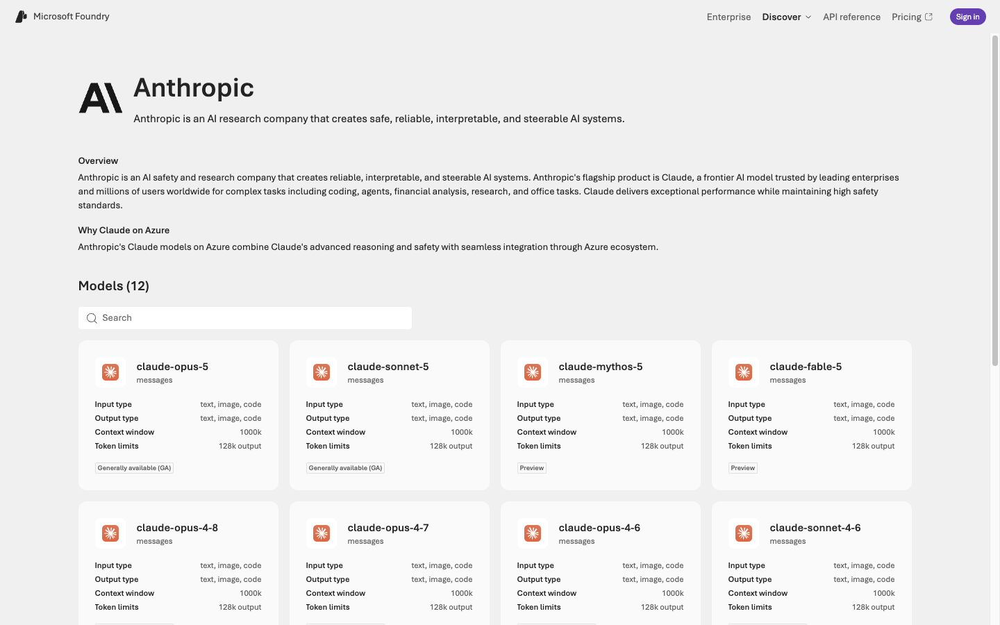
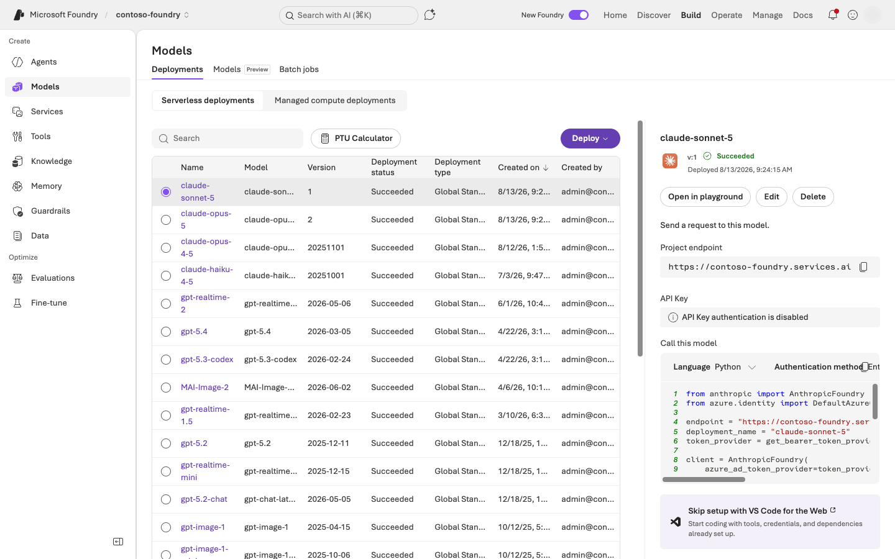
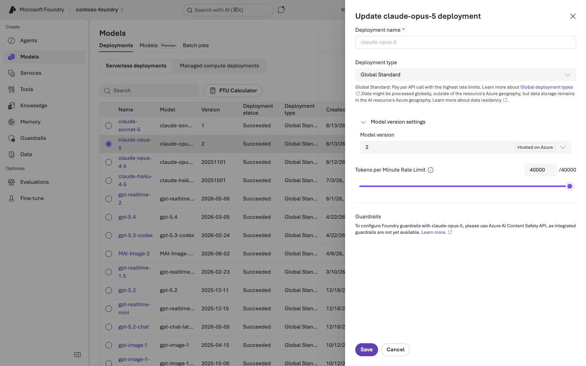
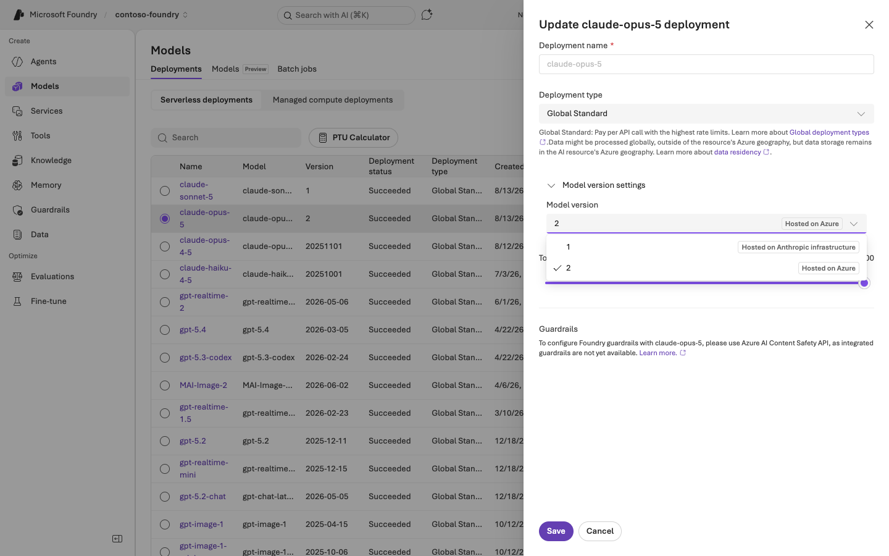
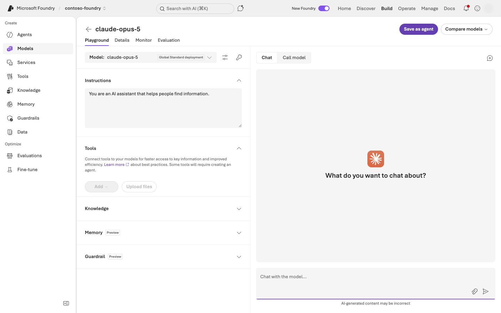
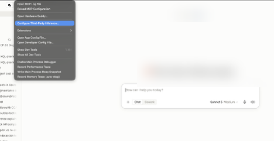
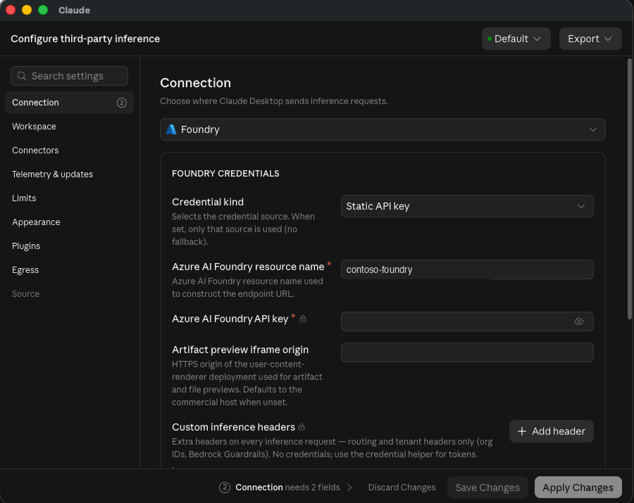
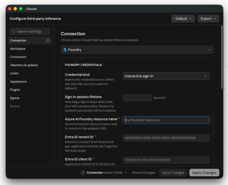
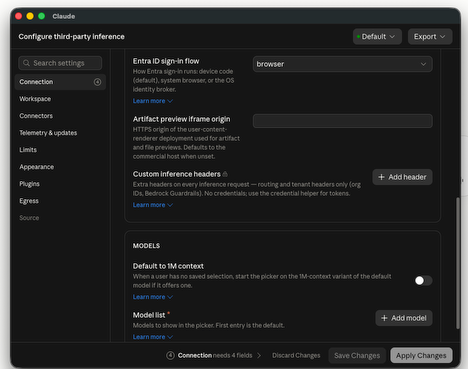

*A working guide to Claude in Microsoft Foundry, Claude Code, and Claude Desktop — including how to run Cowork on your own Azure endpoint.*

I spend most of my week in front of Indian enterprises — banks, NBFCs, fintechs — who want frontier AI without handing a new vendor their data, their procurement cycle, and their compliance posture. For the last year the answer to "can we use Claude?" was awkward. It meant a separate contract, a separate invoice, and a separate conversation with the security team.

That changed. [Claude went generally available in Microsoft Foundry on 29 June 2026](https://azure.microsoft.com/en-us/blog/claude-in-microsoft-foundry-is-now-generally-available/). Claude now runs under your Azure subscription: Entra ID for auth, Azure RBAC for access, Azure Monitor for telemetry, and one line on your existing Azure invoice.

This is the guide I wish I'd had. The API and CLI work below was run against a live Foundry resource; the Claude Desktop walkthrough follows Microsoft's and Anthropic's deployment docs, with screenshots of the actual configuration dialog.

---

## First, get the mental model right

The single most common confusion I see: people assume "Anthropic on Azure" is one thing. It's one **model plane** and three **clients** that can point at it.

| Surface | What it is | Where inference runs |
|---|---|---|
| **Foundry deployment** | The model plane | Your Foundry resource |
| **Claude Code** (CLI) | Terminal coding agent | Your Foundry resource |
| **Claude Desktop** in 3P mode | Desktop app hosting **Cowork and Claude Code** | Your Foundry resource |
| **Cowork on claude.com** | Standard subscription product | Anthropic |

The key point: **Cowork is not locked to Anthropic's infrastructure.** Claude Desktop has a third-party inference mode that routes every model call to your own Foundry resource — billed to your Azure account, with conversations stored locally on the device. That's the deployment enterprises actually want, and it's the least-known part of this whole story.

What you're choosing between is *how your users reach Claude*: terminal, desktop app, or your own code. The governance boundary is the same for all three.

---

## Part 1 — The model plane

Twelve Claude models are in the Foundry catalog today. Opus 5 and Sonnet 5 are GA; Mythos 5 and Fable 5 are in preview. Note the context window: **1000k**.



Deployment is the standard Foundry flow — **Discover → Models**, pick a Claude model, **Deploy**, then **Custom settings**. On your first Claude deployment you'll accept Azure Marketplace terms once.

Here's my resource with four Claude deployments alongside the OpenAI ones. They coexist in a single Foundry resource behind a single endpoint, which is the whole point.



Look at the right-hand pane: **"API Key authentication is disabled."** More on that shortly.

### The decision that actually matters: where inference runs

Buried in **Model version settings** is the most consequential choice in this entire setup, and the portal presents it as though it were a version number.



Open the dropdown and the real meaning appears:



- **Version 1 → Hosted on Anthropic infrastructure**
- **Version 2 → Hosted on Azure**

That's not a version bump. That's a data-residency and architecture decision wearing a version number as a disguise.

With **Hosted on Azure**, inference runs on Azure infrastructure. Prompts and completions stay within Azure; only usage metadata and safety-flagged content leave. For a regulated Indian financial institution, this is usually the deciding factor.

**A practical warning:** the Azure Resource Manager API does *not* expose the hosting option. Querying the deployment returns `"publisher": null` and a bare version string. The portal is the only reliable place to read it. If you're building deployment automation, the version number is your only handle — document it.

### What works on an Azure-hosted deployment, and what doesn't

Tested against a Hosted-on-Azure `claude-opus-5` deployment:

**Works:**
- Structured outputs via `output_config.format`
- Server-side `web_search` — returns real results
- Files API
- Streaming (SSE), prompt caching, extended thinking, the 1M context window

**Doesn't work:**
- `code_execution` — returns `400`, *"not supported in your workspace"*
- Message Batches API — returns `404 api_not_supported` (this one is absent from Foundry entirely, on either hosting option)
- Admin API, Compliance API, Models API, Managed Agents

Plan around `code_execution` and Batches. Everything else you'd reach for in a production RAG or agent workload is available.

One parameter change to watch on Opus 5: `thinking: {"type": "enabled", "budget_tokens": N}` is rejected. The current shape is `thinking: {"type": "adaptive"}` paired with `output_config: {"effort": "high"}`. This isn't Foundry-specific — it's a model-generation change — but it will break code you port over.

One useful detail: `usage.inference_geo` came back `"global"` on the Azure-hosted deployment and `"not_available"` on the Anthropic-hosted one — handy for asserting placement from inside your own telemetry.

---

## Part 2 — Calling it

The endpoint follows a fixed shape:

```
https://{resource}.services.ai.azure.com/anthropic/v1/messages
```

Two auth methods: API keys, or Entra ID. **Use Entra ID.**

The resource I tested has `disableLocalAuth: true`, which removes key auth entirely — that's why the portal shows "API Key authentication is disabled." Try to fetch a key and Azure refuses outright:

```
$ az cognitiveservices account keys list -n <resource> -g <rg>
ERROR: (BadRequest) Failed to list key. disableLocalAuth is set to be true
```

This is the posture to aim for. No key to rotate, no key to leak, no key in a `.env` someone commits at 11pm. Access is Azure RBAC — `Azure AI User` or `Cognitive Services User` — and it's revoked the moment someone leaves the directory.

Here's a real call:

```bash
TOK=$(az account get-access-token --resource https://ai.azure.com --query accessToken -o tsv)

curl https://{resource}.services.ai.azure.com/anthropic/v1/messages \
  -H "content-type: application/json" \
  -H "Authorization: Bearer $TOK" \
  -H "anthropic-version: 2023-06-01" \
  -d '{
    "model": "claude-opus-5",
    "max_tokens": 100,
    "messages": [{"role": "user", "content": "Reply with exactly: Claude on Foundry is live."}]
  }'
```

```json
{"model":"claude-opus-5","type":"message","role":"assistant",
 "content":[{"type":"text","text":"Claude on Foundry is live."}],
 "stop_reason":"end_turn",
 "usage":{"input_tokens":25,"output_tokens":13,"inference_geo":"global"}}
```

In Python, use the Foundry client class rather than the base one:

```python
from anthropic import AnthropicFoundry
from azure.identity import DefaultAzureCredential, get_bearer_token_provider

token_provider = get_bearer_token_provider(
    DefaultAzureCredential(), "https://ai.azure.com/.default"
)

client = AnthropicFoundry(
    azure_ad_token_provider=token_provider,
    resource="your-resource-name",
)

message = client.messages.create(
    model="claude-opus-5",       # deployment name, NOT model ID
    max_tokens=1024,
    messages=[{"role": "user", "content": "What is the capital of France?"}],
)
print(message.content)
```

**The `model` parameter takes your deployment name, not the model ID.** They match by default, which hides the distinction until someone names a deployment `claude-prod` and everything breaks.

### A trap the portal will walk you into

The Foundry portal generates a Python sample for your deployment, and it passes `base_url=`:

```python
client = AnthropicFoundry(
    azure_ad_token_provider=token_provider,
    base_url="https://{resource}.services.ai.azure.com/anthropic",   # portal's version
)
```

Copy that into an environment where you've *also* configured Claude Code — which requires `ANTHROPIC_FOUNDRY_RESOURCE` — and it dies:

```
ValueError: base_url and resource are mutually exclusive
```

The SDK reads `ANTHROPIC_FOUNDRY_RESOURCE` and `ANTHROPIC_FOUNDRY_BASE_URL` from the environment automatically, so your explicit `base_url` collides with the env-supplied resource. Pass exactly one. I use `resource=` and let the SDK build the URL.

Two more traps:

**`output_format` is deprecated.** Use `output_config.format`. My first structured-output call failed on both deployments with a deprecation error I initially misread as a hosting restriction. If you're copying from a blog post written before mid-2026, this will bite you.

**Foundry SDK support is partial.** C#, Java, PHP, Python, and TypeScript have native Foundry clients. Go and Ruby don't — you can point the standard SDK at the base URL, but pass credentials explicitly or you risk leaking a Claude API key to your Azure endpoint.

The portal's **Details** tab generates working sample code for your specific deployment, defaulted to Entra auth. Use it as your starting point.



---

## Part 3 — Claude Code on Foundry

This is the part that surprises people. Claude Code — the terminal agent — points at your Foundry deployment with environment variables. No wizard, no separate subscription. Your developers' agentic coding runs on the same governed endpoint, billed to the same Azure invoice.

```bash
export CLAUDE_CODE_USE_FOUNDRY=1
export ANTHROPIC_FOUNDRY_RESOURCE=<your-resource-name>

# Pin every alias to a deployment that actually exists
export ANTHROPIC_DEFAULT_OPUS_MODEL='claude-opus-5'
export ANTHROPIC_DEFAULT_SONNET_MODEL='claude-sonnet-5'
export ANTHROPIC_DEFAULT_HAIKU_MODEL='claude-haiku-4-5'
```

With no API key set anywhere, auth falls through to the Azure default credential chain — the same `az login` session you already have:

```
$ claude -p "Reply with exactly: Claude Code is running on Microsoft Foundry."
Claude Code is running on Microsoft Foundry.
```

Auth precedence, highest first: `ANTHROPIC_FOUNDRY_AUTH_TOKEN` → `ANTHROPIC_FOUNDRY_API_KEY` → default credential chain. Inside a session, `/status` shows `Microsoft Foundry` and your resource name. (Note `/logout` is unavailable on Foundry — identity is Azure's job now.)

### Pin your models. Seriously.

This is the failure that will generate your first support ticket. Unset the pins and use the bare alias:

```
$ claude -p "say hi" --model opus
The model claude-opus-4-6 is not available on your foundry deployment.
Try --model to switch to claude-opus-4-5, or ask your admin to enable this model.
```

The `opus` alias resolves to Claude Code's built-in Foundry default — Opus 4.6 — which isn't deployed here. Foundry performs no startup model check, so this surfaces at the *first prompt*, not at launch.

Claude Code handles it gracefully with a clear message. But multiply it across fifty developers on rollout day and it's a bad morning. **Pin the aliases, and choose a specific model version on the Azure deployment rather than auto-update-to-latest** — otherwise a silent version bump can move your deployment out from under your pins.

Prompt caching is on automatically. `ENABLE_PROMPT_CACHING_1H=1` extends the TTL from 5 minutes to 1 hour, billed at a higher write rate — usually worth it for large shared codebases.

---

## Part 4 — Claude Desktop on Foundry (and this is where Cowork lives)

[Claude Cowork](https://claude.com/product/cowork) is Anthropic's agent for knowledge work: describe an outcome, grant access to files and connectors, and it executes multi-step tasks — drafting documents, organising files, synthesising research — showing its work as it goes.

Here's the part most people miss. **Claude Desktop is the host application for both Cowork and Claude Code**, and it has a third-party inference mode that points the whole thing at your Foundry resource. Microsoft's documentation puts it plainly: *"all Claude model requests route through your own Foundry resource. Billing stays on your Azure account, conversations remain on user devices."*

No Anthropic seat licensing. No conversation data leaving the device. Token consumption on your Azure bill. For a bank that wants its analysts using an agentic assistant without a new vendor relationship, this is the answer.

### Turn on Developer Mode

Third-party inference is behind a developer flag. In Claude Desktop: **Help → Troubleshooting → Enable Developer Mode**, then **Developer → Configure Third-Party Inference…**



### Pick a credential kind

Set the inference provider to **Foundry**. The next choice — **Credential kind** — decides how much work the rest of this is. Note the dialog's warning: when credential kind is set, *only* that source is used, with no fallback.

**Static API key** is the short path. Two fields: your Foundry resource name, and the API key — **the same key you'd use for any other call to that resource**. Nothing new to create, no Entra app registration, no tenant or client ID. Those fields don't even render in this mode; the footer just says *Connection needs 2 fields*.



That's a shared secret sitting in a managed profile on every device, so it's a pilot configuration, not a rollout one. But if you're demoing this to a customer on Thursday, it's ten minutes of work.

One thing to check first: if your Foundry resource has `disableLocalAuth: true` — as mine does — there is no key to paste, and this path is closed to you entirely. Go straight to interactive sign-in.

**Interactive sign-in** gives you per-user Entra identity, and it's what a real deployment uses. Both **Entra ID tenant ID and client ID are mandatory** — they carry the red asterisk, and the dialog won't let you apply without them.



Those two GUIDs come from an Entra app registration you have to create first. That's the next section.

### Register an Entra ID app (interactive sign-in only)

Skip this entirely if you're using a static API key.

In the [Entra admin center](https://entra.microsoft.com) → **Identity → Applications → App registrations → New registration**. Then:

**API permissions** — add a permission, find **Azure Cognitive Services**, choose **Delegated**, and add **`user_impersonation`**. The app requests it as the scope `https://cognitiveservices.azure.com/.default`. Click **Grant admin consent** — without it, sign-in fails with `AADSTS65001`.

**Authentication** — depends on the sign-in flow you want:

| Flow | Registration requirement |
|---|---|
| `device-code` (default) | Enable **Allow public client flows** |
| `browser` | Add redirect URI `http://127.0.0.1/callback` under **Mobile and desktop applications** |
| `broker` | Allow public client flows + the platform broker redirect URI |

Two traps here, both of which produce error codes you'll otherwise spend an afternoon on:

- The browser flow needs the **literal `127.0.0.1`, not `localhost`**. Entra matches scheme, host, and path exactly — it only ignores the port. Wrong value gives you `AADSTS50011`.
- Register that URI under **Mobile and desktop applications**, *not* **Web**. Under Web, the browser shows a success page and the app still fails, with `AADSTS7000218` buried in the logs.

Finally, grant your users a role on the Foundry resource that permits inference — **Cognitive Services User** is the obvious one. Record the **Directory (tenant) ID** and **Application (client) ID** and paste them into the dialog.

### Sign-in flow and model list

Scroll down for the remaining settings.



**Which flow?** Device code is the default and needs no redirect URI, but Conditional Access policies that block device-code auth will kill it. The browser flow sidesteps that entirely and is my default recommendation. The broker flow is the only one that satisfies Conditional Access policies requiring a compliant or managed device — if your customer has device-compliance CA rules, broker is not optional.

**Model list** — add one entry per Foundry **deployment name**. The first entry is the default. Same rule as everywhere else in this post: deployment name, not model ID.

Then **Apply locally**. Claude Desktop relaunches in 3P mode, and the sign-in screen offers **Start in Cowork on 3P**.

### Roll it out

Once one machine is validated, click **Export** in the same window to produce a `.mobileconfig` (macOS) or `.reg` (Windows) for Intune, Jamf, or Group Policy. Check the **Egress** section for the hostnames to allowlist — sign-in reaches `login.microsoftonline.com` in addition to your Foundry endpoint.

Devices that receive the managed configuration enter 3P mode automatically at first launch. The underlying keys are `inferenceProvider`, `inferenceFoundryResource`, `inferenceFoundryTenantId`, `inferenceFoundryClientId`, `inferenceFoundryAuthFlow`, and `inferenceModels`, so you can also deliver them straight from MDM without the UI.

You can also export full session telemetry — prompts, token counts, estimated cost, tool results, per-user attribution — to your own OpenTelemetry collector.

### One caveat worth stating

Microsoft's documentation is candid about the current state: Anthropic has noted that data-residency and "no conversation data sent to Anthropic" guarantees *equivalent to those already in place for Vertex AI and Amazon Bedrock* are **coming** for Microsoft Foundry. Inference goes to your endpoint and conversations stay on the device today, but if your customer's approval hinges on a contractual guarantee rather than an architectural one, check the current status before you commit to it in a design review.

Also check the subscription type early. Claude models in Foundry require a paid subscription with an active pay-as-you-go billing method. **Free trial, student, credit-only sponsored subscriptions, CSP subscriptions, and Enterprise accounts in South Korea are not supported** — a detail that has derailed more than one proof of concept on day one.

---

## Governance and economics

**Billing.** Claude in Foundry meters in **Claude Consumption Units (CCUs)** — hourly, invoiced monthly in arrears through Azure Marketplace. CCUs are not prepaid credits: no balance, no commitment, no expiry. Usage lands on your Azure invoice and is MACC-eligible, which for a customer with a large Azure commitment is often the entire reason this conversation happens.

**Monitoring.** Azure Monitor for usage and latency, Log Analytics for request logs, Cost Management for forecasting. Anthropic recommends at least 30-day rolling retention.

**RBAC.** `Azure AI User` or `Cognitive Services User` cover it. For tighter scope, a custom role:

```json
{
  "permissions": [
    { "dataActions": ["Microsoft.CognitiveServices/accounts/providers/*"] }
  ]
}
```

**Rate limits — a real gap.** Foundry does **not** return Anthropic's `anthropic-ratelimit-*` headers. If your client backs off based on those headers, that logic is dead on Foundry. Implement exponential backoff on `429` and monitor through Azure instead. Deployment TPM is configurable per deployment in the same Edit pane where the hosting option lives.

**Debugging.** Responses carry both `request-id` and `apim-request-id`. Capture both — you'll need them to trace an issue across Anthropic *and* Azure support.

---

## So which do you pick?

| Choose | When |
|---|---|
| **Claude in Foundry, Hosted on Azure** | Regulated workloads, data-residency requirements, MACC drawdown, unified Azure governance. My default for Indian BFSI. |
| **Claude in Foundry, Hosted on Anthropic** | You need a model or capability not yet on Azure infrastructure — Fable, Mythos, or the newest Opus. Still one Azure invoice. |
| **Claude API direct** | Fastest access to new features, no Azure relationship, or you need Admin/Batches/Managed Agents — none of which exist on Foundry. |

Batch-heavy workloads deserve a flag: the **Message Batches API is not available on Foundry** — it returns `404 api_not_supported`. If your economics depend on batch pricing, Foundry is the wrong platform for that workload.

---

## The gotchas, collected

1. **Pin every model alias.** Bare `opus` resolves to Opus 4.6 and fails at first prompt.
2. **`model` = deployment name**, not model ID.
3. **Hosting option is disguised as a version number** — and ARM won't tell you which is which.
4. **`output_format` is deprecated** → `output_config.format`. Same for `thinking.type.enabled` → `thinking.type.adaptive` + `output_config.effort`.
5. **`base_url` and `resource` are mutually exclusive** in the Python SDK — and the portal's generated sample uses `base_url`, which crashes once `ANTHROPIC_FOUNDRY_RESOURCE` is in your environment.
6. **`code_execution` is unavailable** on Azure-hosted deployments. Structured outputs, web search, and the Files API all work.
7. **No rate-limit headers on Foundry.** Your backoff logic needs rewriting.
8. **Entra tokens expire in ~1 hour.** Use a token provider, not a static token.
9. **No Batches API, no Admin API, no Managed Agents** on Foundry.
10. **Claude Desktop's browser sign-in wants literal `127.0.0.1`**, under **Mobile and desktop applications** — not `localhost`, not the **Web** platform.
11. **Check the subscription type on day one.** Credit-only sponsored, CSP, student, and trial subscriptions can't buy Claude models at all.

---

## Where this leaves us

The interesting shift isn't that Claude runs on Azure. It's that the *governance boundary* and the *model choice* have finally been decoupled. You no longer trade one for the other.

And it goes further than the API. A terminal agent, a desktop app running Cowork, and your own application code can all point at the same Foundry resource, under the same Entra identity, on the same invoice. That's a genuinely different conversation from "which model do we license."

For the customers I work with, that collapses a six-month procurement cycle into a deployment decision — one a platform team can make on a Tuesday afternoon with the security controls they already run.

---

*The API, SDK, and Claude Code sections were executed against a live Foundry resource on 25 August 2026 — every response shown is real output. The Claude Desktop section follows the official Microsoft and Anthropic deployment guides. Foundry portal screenshots have tenant identifiers replaced. Capabilities move quickly — verify against your own deployment before you build on it.*

**References**
- [Claude in Microsoft Foundry is now generally available](https://azure.microsoft.com/en-us/blog/claude-in-microsoft-foundry-is-now-generally-available/)
- [Claude in Microsoft Foundry — Anthropic docs](https://platform.claude.com/docs/en/build-with-claude/claude-in-microsoft-foundry)
- [Claude models in Microsoft Foundry — Microsoft Learn](https://learn.microsoft.com/en-us/azure/foundry/foundry-models/concepts/claude-models)
- [Claude Code on Microsoft Foundry](https://code.claude.com/docs/en/microsoft-foundry)
- [Configure Claude Code for Microsoft Foundry — Microsoft Learn](https://learn.microsoft.com/en-us/azure/foundry/foundry-models/how-to/configure-claude-code)
- [Deploy Claude Desktop on 3P with Microsoft Foundry — Anthropic docs](https://claude.com/docs/third-party/claude-desktop/foundry)
- [Configure Claude Desktop for Microsoft Foundry — Microsoft Learn](https://learn.microsoft.com/en-us/azure/foundry/foundry-models/how-to/configure-claude-desktop)
- [Claude Cowork](https://claude.com/product/cowork)

