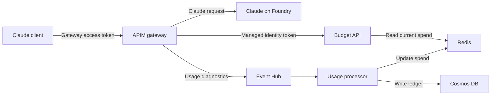
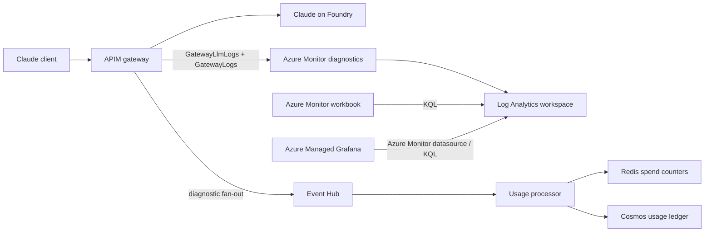
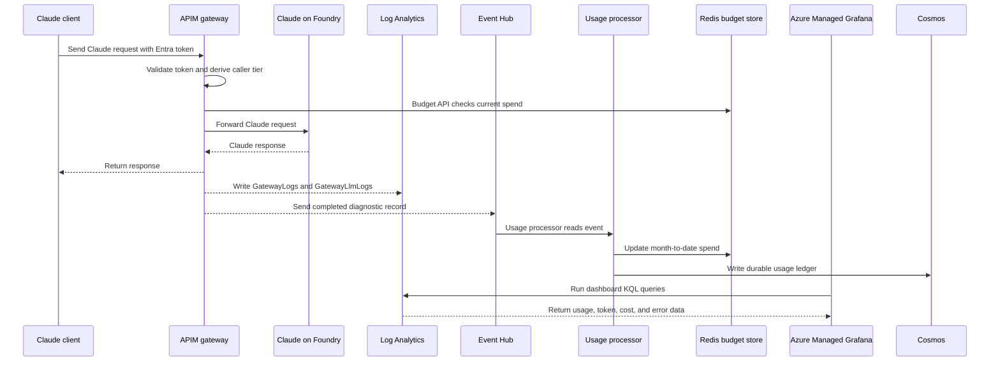

# infra — deployable templates

The Bicep and the assets it deploys, split out of [the guide](../index.md) so you can
run it without reading 1,100 lines of prose first. The guide explains *why* each of
these is shaped the way it is; this directory is the *what*.

Everything here is deployed with `az deployment group create` from the **repository
root** — the paths below assume that, and two templates embed a sibling file by
relative path, so keep this directory intact.

## Scripted Setup

For a parameterized administrator workflow, use the Bash or PowerShell
[setup scripts](../admin/README.md). They orchestrate these templates, publish both
Functions, load pricing, and export client-only settings as
`claude-client-configuration.json` for [Claude Desktop, VS Code and CLI setup](../developer/README.md).
Offline dry runs and explicit execution confirmation are supported. The new scripts
have local mock-based validation; this is separate from the historical template
deployment status below and does not establish live runtime readiness.

## Contents

| File | What it is |
|---|---|
| `03-apim-claude-policy.xml` | The APIM inbound policy: Entra validation, tier derivation, budget check, MI backend auth. Embedded into `04` at deploy time. |
| `04-apim-gateway.bicep` | APIM v2 + system-assigned identity + the Anthropic API + tier named values + the Cognitive Services User role assignment + diagnostics. |
| `08-claude-usage-workbook.json` | The 4-page, 29-tile admin workbook. Embedded into `09`. |
| `09-workbook.bicep` | Deploys that workbook against your workspace. |
| `10-claude-usage-summary-rule.bicep` | Hourly rollup, so reporting survives past raw 30-day retention. |
| `11-grafana.bicep` | Azure Managed Grafana + RBAC. **Billable, and it recurs.** |
| `11a-grafana-workspace-rbac.bicep` | Cross-resource-group role assignment module, used by `11`. |
| `12-claude-usage-grafana-dashboard.json` | The 20-panel Grafana dashboard. |
| `13-import-grafana-dashboard.sh` | Imports it — Azure Managed Grafana has no ARM path for dashboards. |
| `14-claude-tiers.bicep` | `ClaudeTiers()` KQL function, the `PRICING_CL` table, and its DCR. |
| `16-budget-platform.bicep` | Event Hub, Redis, Cosmos, and the two Function Apps. |
| `21-reconciler-metrics-rbac.bicep` | Monitoring Reader for the cost reconciler, on the Foundry account. |
| `22-team-governance.bicep` | Team named values, `ClaudeTeams()` KQL function, workbook, and optional alerts. |
| `23-team-governance-workbook.json` | Team/user utilization, denials, identity drift, and processor health. |

### Team governance ownership

[`admin/setup.example.json`](../admin/setup.example.json) has an optional
`teamGovernance` block is validated by [`admin/validate-config.jq`](../admin/validate-config.jq)
and forwarded to module `16`, module `22`, and the APIM policy. Source config owns declared
limits/mappings; the standalone admin scripts own additive Microsoft Graph reconciliation;
Bicep owns Azure resources and settings. Redis is disposable enforcement state, while Cosmos
is the immutable request ledger used to reconstruct user and team counters.


The Python and shell that run *against* this platform live in
[`../snippets/`](../snippets/) — the usage processor, the budget API, the pricing
loader, the cost reconciler, and the smoke tests.

## Deployment status — read this before you trust anything

These templates were not all deployed from scratch. Each file's own header is the
authoritative record; this is the summary.

| Template | Status |
|---|---|
| `16-budget-platform.bicep` | **Deployed and verified end to end, 2026-09-04.** Gateway traffic reaches Redis as month-to-date dollars within ~90s; the Cosmos ledger fills; the policy returns 403 on an over-budget developer. |
| `14-claude-tiers.bicep` | **Deployed and verified 2026-09-04.** |
| `09-workbook.bicep` | **Deployed and verified 2026-09-02** against a live workspace; all 22 queries run against real data. |
| `04-apim-gateway.bicep` | **Compiles; the policy it deploys is verified.** But the policy was proven by applying it with `az rest` to an APIM that already existed — *this template's own resource composition has never been deployed from scratch.* |
| `10`, `11`, `11a`, `21` | Compile. Not deployed from scratch. |

Cloud APIs move. Verify against your own subscription.

## Prerequisites

1. **A Foundry resource with a Claude deployment.** Note the account name; `04` builds
   its backend URL as `https://<account>.services.ai.azure.com/anthropic`.
2. **A Log Analytics workspace.** Nearly every template takes its resource ID.
3. **An Entra app registration** for the gateway, with a `Claude.User` app role that
   your users are assigned.
4. **Permission to manage the Desktop client registration.** The administrator
   setup scripts create or reuse a dedicated public client and pre-authorize it on
   the gateway API. The setup identity must be able to create/read Entra
   applications and update the gateway API application.
5. **The `aud` value your clients will actually present.** This is the one that
   catches people: if the app has `requestedAccessTokenVersion: 2`, the `aud` claim is
   the **bare application ID**, *not* the `api://<guid>` identifier URI. Decode a real
   token and read it rather than guessing — every request 401s if this is wrong, and
   nothing in the error says why.
6. **An APIM v2 SKU.** `BasicV2`, `StandardV2`, or `PremiumV2` — the `llm-*` policies
   only understand the Anthropic Messages schema on v2. `az apim create --sku-name`
   cannot create these at all, which is the reason this is Bicep and not CLI.

## Deploy order

The gateway and the budget platform reference each other, so **`04` is deployed twice**.
For a new APIM, the first pass uses `deployPolicy=false`; module `22` creates the named values
referenced by the policy before the final `04` pass enables it.

### 1. The gateway

Leave `budgetApiBaseUrl` at its `https://budget-api.invalid` default on this first
pass. The policy's budget lookup fails, `ignore-error` swallows it, and every request
is treated as within budget — which is what you want before the budget platform
exists.

```bash
az deployment group create -g <rg> -f infra/04-apim-gateway.bicep \
   -p apimName=<name> apimLocation=<apim region> foundryAccountName=<foundry> \
      publisherEmail=you@contoso.com gatewayAudience=<app-id> \
      logAnalyticsWorkspaceId=<workspace resource id>
```

`apimLocation` must match the Event Hub namespace region once Event Hub diagnostics
are enabled. The Log Analytics workspace can remain in its existing region.

APIM v2 provisioning takes a while. Role assignments then take up to five more minutes
to propagate — if your first call 403s, wait before you start debugging.

At this point the gateway works. Smoke-test it with
[`../snippets/05-gateway-smoke-test.sh`](../snippets/05-gateway-smoke-test.sh) before
building anything on top.

### 1a. The Claude Desktop public client

This step is automatic when using `admin/claude-gateway-setup.sh` or
`admin/claude-gateway-setup.ps1` with the `all` or `export` stage. Leave
`clientConfiguration.clientId` empty in the admin config. Setup then:

1. Creates or reuses `Claude Desktop - <APIM name>` as a single-tenant public
   client.
2. Registers `http://localhost` and `http://127.0.0.1/callback` for Claude
   Desktop's loopback sign-in.
3. Adds the gateway API's enabled `access_as_user` delegated permission and creates
   the client service principal if needed.
4. Pre-authorizes that client on the gateway API and writes its application ID to
   the generated `claude-client-configuration.json`.

The Desktop registration is separate from the protected gateway API registration;
using the gateway API application ID as the Desktop client ID causes reply-address
errors such as `AADSTS500113`. No client secret is needed or created. Assign each
user or onboarding group to the gateway API's `Claude.User` application role
separately. To bring an existing public client, set its application ID in
`clientConfiguration.clientId`; setup validates and configures it instead of
creating another registration.

### 2. Tiers and pricing

```bash
az deployment group create -g <rg> -f infra/14-claude-tiers.bicep \
   -p workspaceName=<log analytics workspace>
```

Then load prices into `PRICING_CL` with
[`../snippets/15-load-pricing.py`](../snippets/15-load-pricing.py), using the
`logsIngestion` endpoint this deployment outputs. Claude prices are absent from the
Azure retail API — it is Marketplace-billed — so the loader carries a maintained list.
**Update it to match your agreement.** Prices are stored per 1K tokens, not per 1M.

### 3. The budget platform

```bash
az deployment group create -g <rg> -f infra/16-budget-platform.bicep \
   -p namePrefix=<prefix-11-chars-max> logAnalyticsWorkspaceId=<workspace resource id>
```

`namePrefix` must be **11 characters or fewer**; the template uses it inside several
generated resource names, and ARM rejects longer values before deployment starts.
`logAnalyticsWorkspaceId` must be the workspace's full Azure resource ID, not just the
workspace name.

Then deploy the two Function Apps from [`../snippets/`](../snippets/):
`17-usage-processor/` and `18-budget-api/`.

### 4. Team governance and the gateway again

This is not a second gateway. Re-deploying the same template with the same resource
names updates the existing APIM resources. The first deployment creates APIM so its
managed identity exists; step 3 then creates the Event Hub and Budget API whose IDs
and URL APIM could not know. Reconcile Entra groups/app roles when mode is active,
deploy `22-team-governance.bicep`, validate its outputs, then deploy `04` with
`deployPolicy=true`. This ordering prevents unresolved APIM named-value references.



The values connect these parts as follows:

- `gatewayAudience` identifies the gateway API. Tokens sent by Claude clients to
   APIM must carry this value in their `aud` claim.
- `eventHubAuthorizationRuleId` gives APIM diagnostics permission to send completed
   request records to the Event Hub namespace. `eventHubName` selects the Event Hub
   inside that namespace.
- `budgetApiBaseUrl` tells the APIM policy where to call the combined
   `GET /v2/budget/<team-id>/<user-object-id>` verdict before forwarding a governed request.
- `budgetApiAudience` is the Application (client) ID of the Budget API's Entra app
   registration. APIM requests a managed-identity token for this audience, and the
   Budget API validates that the token was intended for it. Use the bare application
   ID, not the app registration's object ID and not `api://<application-id>`.

The Budget API deployment also needs APIM's managed-identity **client ID** as its
`apimIdentityClientId`: the audience identifies the API being called, while this
client ID identifies the one application allowed to call it. Together they enforce
"token intended for the Budget API" and "caller is this APIM gateway."

Take three outputs from step 3 and the Budget API app registration ID, then re-deploy
`04` with them:

```bash
az deployment group create -g <rg> -f infra/04-apim-gateway.bicep \
   -p apimName=<name> apimLocation=<apim region> foundryAccountName=<foundry> \
      publisherEmail=you@contoso.com gatewayAudience=<app-id> \
      logAnalyticsWorkspaceId=<workspace resource id> \
      eventHubAuthorizationRuleId=<from 16> \
      eventHubName=<from 16> \
      budgetApiBaseUrl=<from 16> \
      budgetApiAudience=<the budget API app registration ID>
```

Verify per-tier limits and the three rejection reasons with
[`../snippets/19-tier-smoke-test.sh`](../snippets/19-tier-smoke-test.sh).

### 5. Reporting (optional)

```bash
# The Azure Monitor workbook
az deployment group create -g <rg> -f infra/09-workbook.bicep \
   -p workbookLocation=<workbook region> logAnalyticsWorkspaceId=<workspace resource id>

# Hourly rollup, for history past 30-day retention
az deployment group create -g <rg> -f infra/10-claude-usage-summary-rule.bicep \
   -p workspaceName=<log analytics workspace name>
```

`10` has a second step its header spells out in full: the destination table is created
by the first bin, not by the deployment, so **its retention must be PATCHed
afterwards** — and `az monitor log-analytics workspace table update` fails on it,
because it sends the whole schema and the summary-rule columns fail its own validation.
Use `az rest --method patch`. Skipping this leaves the rollup at 30 days, which defeats
the point of building it.

### 6. Grafana (optional, **billable**)

~$25/month for the node plus $6/user/month, and it recurs. The `Essential` SKU appears
in the retail price list but ARM rejects it in every region and api-version tried;
budget for `Standard`.

```bash
az provider register --namespace Microsoft.Dashboard   # not registered by default
az deployment group create -g <rg> -f infra/11-grafana.bicep \
   -p grafanaName=<name> logAnalyticsWorkspaceId=<workspace resource id> \
      adminPrincipalId=$(az ad signed-in-user show --query id -o tsv)

./infra/13-import-grafana-dashboard.sh <grafana-name> <resource-group> <workspace-resource-id>
```

The dashboard is a separate import because Azure Managed Grafana exposes no ARM path
for dashboards.

#### Standalone reporting refresh

Run this from the repository root after `14-claude-tiers`, `10-claude-usage-summary-rule`,
and `11-grafana` have been deployed. The scripts use your current `az login` identity.
That identity needs Monitoring Metrics Publisher on the direct DCR and Monitoring Reader
on the Foundry account.

```bash
SUBSCRIPTION=<subscription-id>
RG=<resource-group>
WORKSPACE=<log-analytics-workspace>
FOUNDRY_ACCOUNT=<ai-services-account>
GRAFANA=<managed-grafana-name>

python3 -m venv .venv
.venv/bin/python -m pip install azure-identity azure-monitor-ingestion requests

DCR_ENDPOINT=$(az deployment group show -g "$RG" -n 14-claude-tiers \
   --query properties.outputs.pricingDcrEndpoint.value -o tsv)
DCR_ID=$(az deployment group show -g "$RG" -n 14-claude-tiers \
   --query properties.outputs.pricingDcrImmutableId.value -o tsv)
WORKSPACE_ID=$(az monitor log-analytics workspace show -g "$RG" -n "$WORKSPACE" \
   --query id -o tsv)
FOUNDRY_ID=$(az resource show -g "$RG" -n "$FOUNDRY_ACCOUNT" \
   --resource-type Microsoft.CognitiveServices/accounts --query id -o tsv)

# Maintained APIM-visible input/output rates.
.venv/bin/python snippets/15-load-pricing.py \
   --dcr-endpoint "$DCR_ENDPOINT" --dcr-immutable-id "$DCR_ID"

# True aggregate model cost, including cache writes. Safe to rerun: readers dedupe bins.
.venv/bin/python snippets/20-cost-reconciler.py --resource-id "$FOUNDRY_ID" \
   --hours 72 --dcr-endpoint "$DCR_ENDPOINT" --dcr-immutable-id "$DCR_ID"

# Retained user/team/model usage. Schema changes apply only to newly generated bins.
az deployment group create --subscription "$SUBSCRIPTION" -g "$RG" \
   -n 10-claude-usage-summary-rule -f infra/10-claude-usage-summary-rule.bicep \
   -p workspaceName="$WORKSPACE"

# Keep 30 days interactive and 370 additional days in archive.
az rest --method patch --headers 'Content-Type=application/json' \
   --url "https://management.azure.com${WORKSPACE_ID}/tables/ClaudeUsageHourly_CL?api-version=2022-10-01" \
   --body '{"properties":{"retentionInDays":30,"totalRetentionInDays":400}}'

# Re-import after dashboard JSON changes.
./infra/13-import-grafana-dashboard.sh "$GRAFANA" "$RG" "$WORKSPACE_ID"
```

The summary rule cannot reconstruct team attribution for old requests. Its `TeamId`,
`TeamProfile`, and `TeamState` columns begin filling only after the updated rule is active,
and APIM must receive a new inference request using a token issued after team role changes.
Foundry cache metrics have no caller dimension, so `ClaudeCostRollup_CL` remains aggregate;
developer and team chargeback intentionally shows APIM-visible estimated cost only.

Validate ingestion after Azure's normal propagation delay:

```kusto
union
   (PRICING_CL | summarize Rows=count(), Last=max(TimeGenerated) | extend Table="PRICING_CL"),
   (ClaudeCostRollup_CL | summarize Rows=count(), Last=max(TimeGenerated) | extend Table="ClaudeCostRollup_CL"),
   (ClaudeUsageHourly_CL | summarize Rows=count(), Last=max(TimeGenerated) | extend Table="ClaudeUsageHourly_CL")
| project Table, Rows, Last
```

In plain terms, `11-grafana.bicep` creates the empty Grafana instance and grants it
permission to read the Log Analytics workspace. `13-import-grafana-dashboard.sh` then
loads the actual dashboard JSON into that instance. The script does not create APIM,
Log Analytics, Event Hub, or Grafana itself; it only replaces the portable workspace
placeholder in `12-claude-usage-grafana-dashboard.json` with the real workspace
resource ID and imports the result through the Grafana API.

Grafana does **not** call APIM directly. APIM writes gateway telemetry through Azure
Monitor diagnostics; Log Analytics stores it; Grafana queries Log Analytics through
the Azure Monitor datasource and renders the charts.



The request and reporting flow is:



The related pieces are:

| Piece | Role |
|---|---|
| APIM | Front door for Claude requests; stamps caller/tier headers and emits gateway logs. |
| Azure Monitor diagnostics | Copies APIM telemetry to Log Analytics and, when configured, Event Hub. |
| Log Analytics | Stores queryable gateway logs, pricing tables, rollups, and platform logs. |
| Azure Monitor workbook | Native Azure Portal reporting surface over the same Log Analytics data. |
| Azure Managed Grafana | Optional richer dashboard surface over the same Log Analytics data. |
| Event Hub + processor + Redis/Cosmos | Budget-enforcement path; separate from Grafana, but fed by the same APIM diagnostics. |

If Grafana panels are empty but the same KQL works in Log Analytics, check the Azure
Monitor datasource selection, then verify Grafana's managed identity has Monitoring
Reader on the workspace, then confirm the dashboard time range overlaps your data.

### 7. Cache-write reconciliation (optional)

`21-reconciler-metrics-rbac.bicep` is a **module**, not a standalone deployment — the
Foundry account is usually in a different resource group, and Bicep rejects a
cross-resource-group role assignment with `BCP139`. Its header has the `module` block
to paste. It grants Monitoring Reader so
[`../snippets/20-cost-reconciler.py`](../snippets/20-cost-reconciler.py) can read the
cache-token metrics — the only place on Azure where cache **writes** are reported at
all.

The setup wrapper additionally grants the reconciliation principal Cosmos SQL Data Reader
through `admin/pricing-access.bicep`. `20-cost-reconciler.py` queries current-month immutable
ledger rows and replaces Redis user/tier/team/profile totals and over-budget flags with
month-end-plus-one-day TTLs. Unknown teams, changed profiles, inconsistent tiers, or missing
request-time attribution stop replay; operators must resolve drift rather than reassign history.

## `tiersConfig` is declared three times

`04`, `14`, and `16` each take a `tiersConfig` array, and **they must match**. A
mismatch is silent: the policy throttles on one set of numbers while the processor
budgets against another.

```bicep
[
  { name: 'pro',   tpm: 40000, tokenQuota: 350000000, costQuota: 1000 }
  { name: 'basic', tpm: 20000, tokenQuota: 175000000, costQuota: 500 }
  { name: 'lite',  tpm: 4000,  tokenQuota: 35000000,  costQuota: 100 }
]
```

`tpm` and `tokenQuota` become APIM named values the policy reads. `costQuota` is **not
used by APIM at all** — it is the dollar budget the usage processor enforces, and it
lives here only so all three numbers for a tier are declared in one place.
[`../TIERED-QUOTAS.md`](../TIERED-QUOTAS.md) explains how the token quota is sized:
budget divided by the *cheapest* model rate, so it does not bind before the dollar cap.

## Known gap: cost coverage is incomplete

The budget platform meters uncached input, output, and cache reads. **Cache writes are
missing**, and in a measured seven-day sample they were 62% of Opus 5 spend. The
workbook omits reads as well. Treat these as partial-cost limits, not complete dollar
ceilings. [`../CACHE-TOKEN-ANALYSIS.md`](../CACHE-TOKEN-ANALYSIS.md) has the evidence
and the remediation design.

## Building without deploying

```bash
for f in infra/*.bicep; do az bicep build --file "$f" --stdout > /dev/null \
  && echo "OK  $f" || echo "FAIL $f"; done
```

Expect one suppressed `BCP037` in `04` — the `largeLanguageModel` diagnostic property
is accepted by the ARM API but missing from the Bicep type definition. Keep the
suppression; dropping the property turns off LLM logging entirely.
